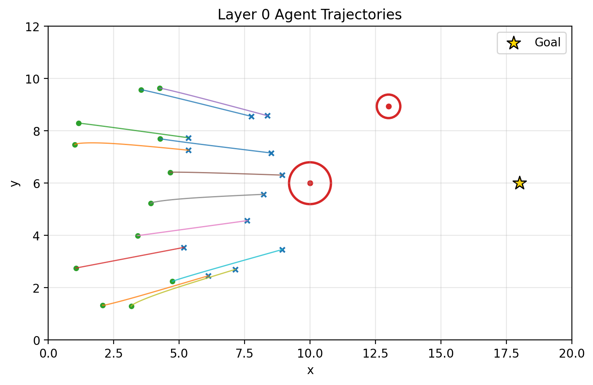
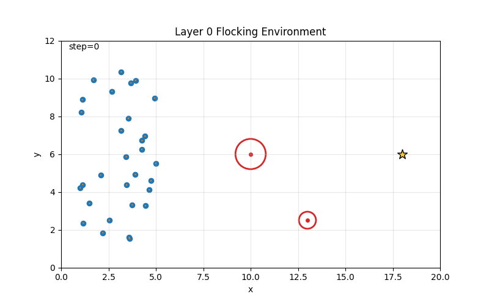
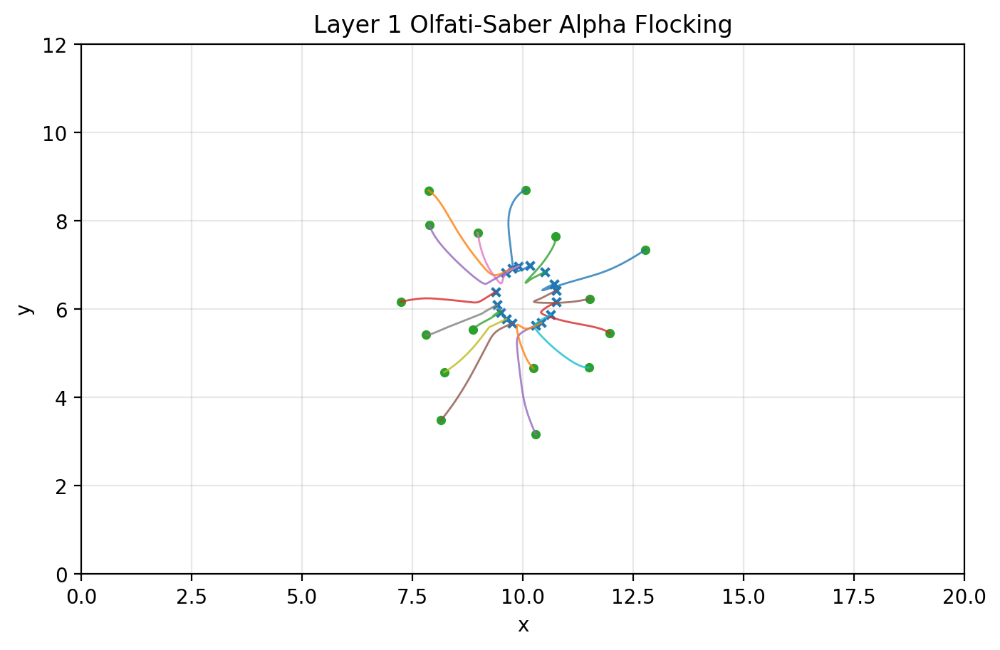
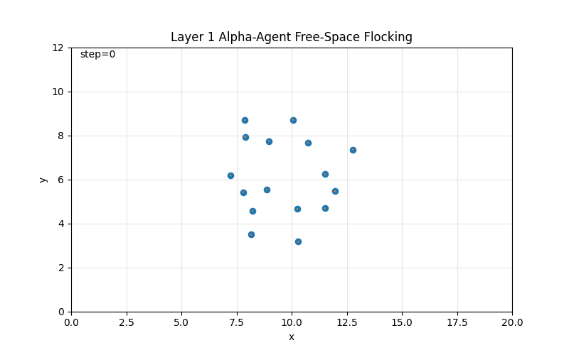
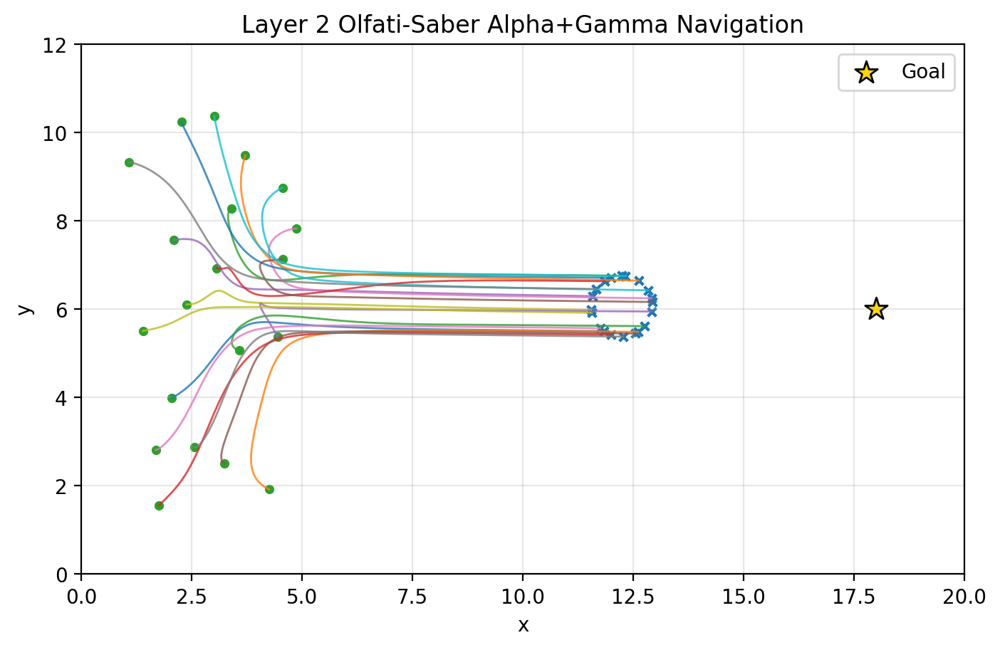
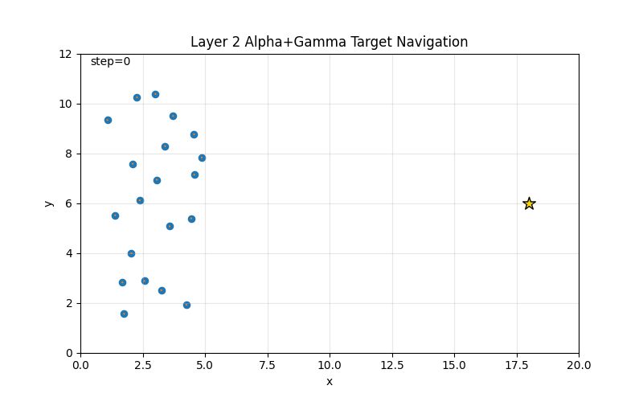
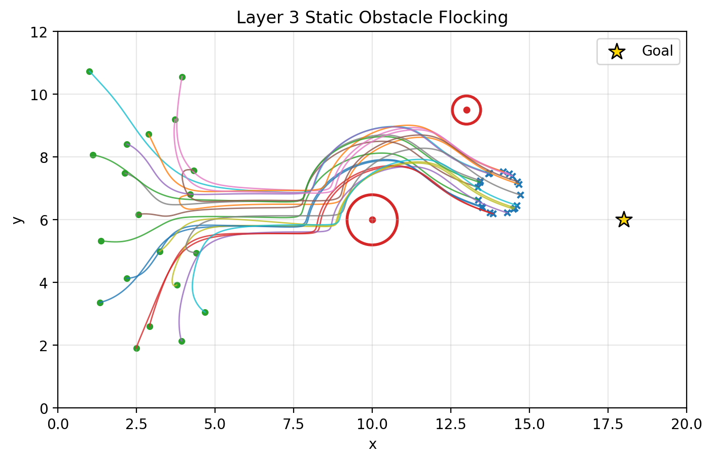
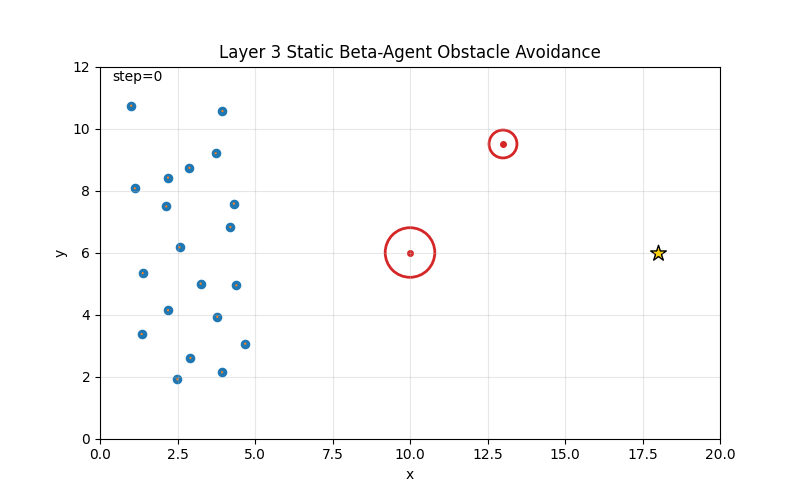
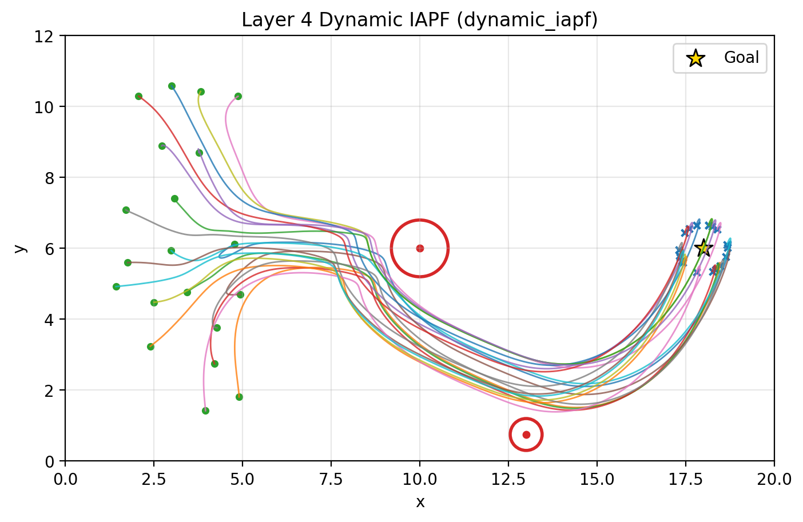
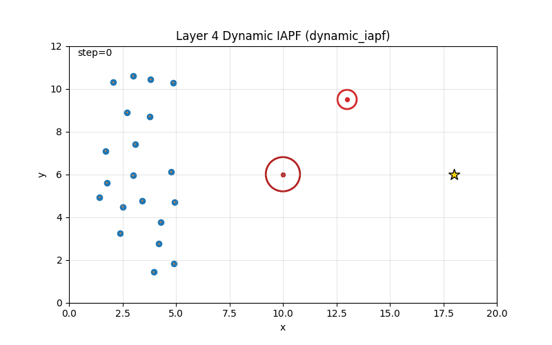

# Multi-Agent Flocking Pipeline: 当前实现、公式与实验结果

本文档描述 `/opt/data/private/Multi-Agent/flocking` 当前已经实现的多智能体 flocking 复现实验。实现目标是从一个轻量级二维多智能体仿真环境出发，逐层复现和扩展 Olfati-Saber flocking 框架，并在最后加入 Shao et al. 动态障碍物避障思想的工程化实现。

当前代码位于：

```text
/opt/data/private/Multi-Agent/flocking/mas_flocking/
```

当前已经完成的层级如下。

| Layer | 内容 | 控制律 | 当前状态 |
|---|---|---|---|
| Layer 0 | 二阶点质量多智能体仿真环境 | demo controller | 已实现 |
| Layer 1 | Olfati-Saber free-space alpha-agent flocking | `u = u_alpha` | 已实现 |
| Layer 2 | gamma-agent 目标导航 | `u = u_alpha + u_gamma` | 已实现 |
| Layer 3 | static beta-agent 静态圆形障碍物避障 | `u = u_alpha + u_beta + u_gamma` | 已实现 |
| Layer 4 | Shao-inspired dynamic IAPF 动态障碍物避障 | `u = u_alpha + u_beta + u_gamma + u_dyn` | 已实现 |

参考论文：

- `papers/Flocking_for_multi-agent_dynamic_systems_algorithms_and_theory.pdf`
- `papers/Dynamic_Obstacle-Avoidance_Algorithm_for_Multi-Robot_Flocking_Based_on_Improved_Artificial_Potential_Field.pdf`

需要注意：Layer 1 到 Layer 3 尽量贴近 Olfati-Saber 的 alpha/beta/gamma-agent 分层思想；Layer 4 是 Shao et al. 动态障碍物避障思想的工程化、预测式 IAPF 实现，不是对 Shao 原文所有速度融合公式的逐式完整复现。

---

## 1. 环境与运行方式

项目使用 Conda 环境：

```bash
conda create -n mas_flocking python=3.10
conda activate mas_flocking
pip install -r requirements.txt
```

或者使用仓库中的环境文件：

```bash
conda env create -f environment.yml
conda activate mas_flocking
```

单元测试：

```bash
python -m unittest discover -s tests -v
```

当前测试结果：`31 tests OK`。

---

## 2. 代码结构

```text
mas_flocking/
  __init__.py
  utils.py                         # 数组形状检查、向量裁剪等通用工具
  obstacles.py                     # CircleObstacle 静态/动态圆形障碍物
  simulator.py                     # FlockingEnv 二阶点质量仿真器
  controllers.py                   # Layer 0 基础 zero/goal PD 控制器
  metrics.py                       # 速度一致性、连通性、避障、目标距离等指标
  visualize.py                     # 轨迹图、动画、指标曲线绘制
  main.py                          # Layer 0 demo
  alpha_flocking.py                # Layer 1 alpha-agent 控制
  gamma_navigation.py              # Layer 2 gamma-agent 目标导航
  beta_obstacle.py                 # Layer 3 beta-agent 静态障碍物避障
  dynamic_iapf.py                  # Layer 4 dynamic IAPF 动态障碍物避障
  layer1_free_flocking.py          # Layer 1 实验入口
  layer2_target_navigation.py      # Layer 2 实验入口
  layer3_static_obstacles.py       # Layer 3 实验入口
  layer4_dynamic_iapf.py           # Layer 4 实验入口

tests/
  test_layer0.py
  test_layer1_alpha.py
  test_layer2_gamma.py
  test_layer3_beta.py
  test_layer4_dynamic_iapf.py

outputs/
  animations/
  figures/
  logs/
```

整体设计原则是：

- `FlockingEnv` 只负责动力学、边界、障碍物状态推进，不把具体 flocking 控制律写进环境。
- 每个控制层单独放在一个模块中，方便后续做 ablation。
- 每个 demo 都输出轨迹图、指标曲线、CSV 日志和可选 GIF。
- Layer 1/2/3/4 的控制项可以直接相加，便于比较不同模块的贡献。

---

## 3. Layer 0: 基础多智能体仿真环境

### 3.1 状态与动力学

每个 agent 是二维二阶点质量模型：

$$
q_i \in \mathbb{R}^2, \quad p_i \in \mathbb{R}^2, \quad u_i \in \mathbb{R}^2
$$

其中：

- `q_i` 是位置；
- `p_i` 是速度；
- `u_i` 是控制输入，也可以理解为加速度。

连续模型：

$$
\dot q_i = p_i
$$

$$
\dot p_i = u_i
$$

当前代码使用 semi-implicit Euler 更新：

$$
\tilde u_i = \operatorname{clip}_{u_{max}}(u_i)
$$

$$
p_i(t+\Delta t) = \operatorname{clip}_{v_{max}}\left(p_i(t)+\tilde u_i\Delta t\right)
$$

$$
q_i(t+\Delta t)=q_i(t)+p_i(t+\Delta t)\Delta t
$$

对应代码：`mas_flocking/simulator.py` 中的 `FlockingEnv.step()`。

默认参数：

| 参数 | 默认值 |
|---|---:|
| `n_agents` | `30` |
| `dt` | `0.02` |
| `world_size` | `(20.0, 12.0)` |
| `v_max` | `3.0` |
| `u_max` | `8.0` |
| `boundary_mode` | `reflect` |

`boundary_mode` 支持：

| 模式 | 含义 |
|---|---|
| `reflect` | 碰到边界后反弹 |
| `clip` | 位置裁剪到边界，速度不反弹 |
| `none` | 不处理边界，适合目标迁移和避障实验 |

### 3.2 初始化方式

`FlockingEnv.reset(init_mode=...)` 支持：

| 模式 | 用途 |
|---|---|
| `random_left` | agent 初始化在地图左侧，适合目标迁移 |
| `random_center` | agent 初始化在地图中部，适合 free-space flocking |
| `custom` | 手工传入 `q0/p0`，适合单元测试 |

### 3.3 障碍物

障碍物由 `CircleObstacle` 表示：

```python
CircleObstacle(
    center=(x, y),
    radius=r,
    velocity=(vx, vy),
    dynamic=True or False,
)
```

动态障碍物会在 `env.step()` 中调用 `obstacle.step(...)` 随时间移动。

### 3.4 Layer 0 demo

运行：

```bash
python -m mas_flocking.main
```

输出：

- `outputs/figures/layer0_trajectories.png`
- `outputs/animations/layer0_demo.gif`
- `outputs/logs/layer0_metrics.csv`

轨迹图：



动画：



Layer 0 主要验证环境动力学、障碍物显示、指标记录和可视化链路，不作为正式 flocking 控制效果评价。

---

## 4. Layer 1: Olfati-Saber Free-Space Alpha-Agent Flocking

Layer 1 实现 Olfati-Saber Algorithm 1 中的 alpha-agent interaction terms：距离保持项加速度一致项。此层没有目标点，也没有障碍物。

控制律：

$$
u_i = u_i^\alpha
$$

### 4.1 Sigma norm

Olfati-Saber 使用光滑的 sigma norm：

$$
\|z\|_\sigma = \frac{\sqrt{1+\epsilon\|z\|^2}-1}{\epsilon}
$$

代码：`alpha_flocking.sigma_norm(...)`。

### 4.2 Smooth direction vector

两个 agent 之间的光滑方向向量为：

$$
n_{ij} = \frac{q_j-q_i}{\sqrt{1+\epsilon\|q_j-q_i\|^2}}
$$

代码：`alpha_flocking.sigma_unit_vectors(...)`。

### 4.3 Bump function

有限通信半径使用 smooth bump function：

$$
\rho_h(z)=
\begin{cases}
1, & 0 \le z < h \\
\frac{1}{2}\left(1+\cos\left(\pi\frac{z-h}{1-h}\right)\right), & h \le z \le 1 \\
0, & z > 1
\end{cases}
$$

代码：`alpha_flocking.bump_function(...)`。

### 4.4 Weighted adjacency

代码没有使用简单的硬邻接，而是使用论文中的 weighted proximity graph：

$$
r_\alpha = \|r\|_\sigma
$$

$$
a_{ij}(q)=\rho_h\left(\frac{\|q_j-q_i\|_\sigma}{r_\alpha}\right)
$$

并且强制：

$$
a_{ii}=0
$$

代码：`alpha_flocking.alpha_adjacency_matrix(...)`。

### 4.5 Action function

scalar helper：

$$
\sigma_1(z)=\frac{z}{\sqrt{1+z^2}}
$$

Olfati-Saber action function：

$$
\phi(z)=\frac{1}{2}\left((a+b)\sigma_1(z+c)+(a-b)\right)
$$

其中：

$$
c=\frac{|a-b|}{\sqrt{4ab}}
$$

alpha action：

$$
d_\alpha = \|d\|_\sigma
$$

$$
\phi_\alpha(z)=\rho_h\left(\frac{z}{r_\alpha}\right)\phi(z-d_\alpha)
$$

代码：`alpha_flocking.phi(...)` 和 `alpha_flocking.phi_alpha(...)`。

这里特别注意：实现中使用的是 `d_alpha = ||d||_sigma`，没有直接把欧氏距离 `d` 塞进 sigma-norm 变量里。这样平衡距离更符合论文写法。

### 4.6 Alpha control

alpha 控制由两部分组成：

$$
u_i^\alpha = c_1^\alpha \sum_{j=1}^{N}\phi_\alpha(\|q_j-q_i\|_\sigma)n_{ij}
+ c_2^\alpha \sum_{j=1}^{N}a_{ij}(q)(p_j-p_i)
$$

第一项负责维持距离并形成 alpha-lattice；第二项负责速度一致性。

代码：`alpha_flocking.alpha_flocking_control(q, p, params)`。

默认参数：

| 参数 | 默认值 | 含义 |
|---|---:|---|
| `epsilon` | `0.1` | sigma norm 平滑参数 |
| `h` | `0.2` | bump function 平滑区间 |
| `d` | `1.2` | 期望 agent-agent 距离 |
| `r` | `3.0` | sensing radius |
| `a` | `5.0` | action function 参数 |
| `b` | `5.0` | action function 参数 |
| `c1_alpha` | `1.0` | 距离保持项增益 |
| `c2_alpha` | `2.0` | 速度一致项增益 |

### 4.7 Layer 1 demo

运行：

```bash
python -m mas_flocking.layer1_free_flocking --n-steps 1000 --skip-animation
```

生成 GIF：

```bash
python -m mas_flocking.layer1_free_flocking --n-steps 1000
```

输出：

- `outputs/figures/layer1/layer1_alpha_trajectories.png`
- `outputs/animations/layer1/layer1_alpha_flocking.gif`
- `outputs/logs/layer1/layer1_alpha_metrics.csv`

轨迹图：



动画：



### 4.8 Layer 1 结果

| 指标 | final | min | max | mean |
|---|---:|---:|---:|---:|
| velocity consensus error | `0.002152` | `0.002152` | `1.722054` | `0.179377` |
| min agent distance | `0.149182` | `0.149182` | `0.845809` | `0.226800` |
| lattice deviation energy | `0.220075` | `0.200387` | `1.074882` | `0.283687` |
| mean neighbor count | `15.000000` | `6.625000` | `15.000000` | `14.535125` |
| connected components | `1` | `1` | `1` | `1` |
| lambda_2 | `16.000000` | `2.101423` | `16.000000` | `15.011083` |

结果解读：

- 速度一致性最终降到 `0.002152`，说明 alpha 速度同步项工作正常。
- 连通分量始终为 `1`，说明当前初始化下 flock 没有 fragmentation。
- `lattice_deviation_energy` 明显下降并保持较低，说明距离调节项能形成较稳定的局部结构。
- Layer 1 不包含 gamma-agent，因此不会主动向某个目标点移动。

---

## 5. Layer 2: Gamma-Agent Target Navigation

Layer 2 在 Layer 1 的基础上加入 gamma-agent 目标导航，对应 Olfati-Saber Algorithm 2 的思想。

总控制律：

$$
u_i = u_i^\alpha + u_i^\gamma
$$

默认目标点沿用 Layer 0 的地图目标：

$$
q_r = [18.0, 6.0]^T
$$

$$
p_r = [0.0, 0.0]^T
$$

即当前默认是 static gamma-agent。

### 5.1 Vector sigma saturation

gamma 项使用的是向量饱和函数，而不是 Layer 1 action function 中的 scalar `sigma_1`：

$$
\sigma_1^{vec}(z)=\frac{z}{\sqrt{1+\|z\|^2}}
$$

代码：`gamma_navigation.vector_sigma_1(...)`。

### 5.2 Gamma navigation control

位置误差与速度误差：

$$
e_q = q_i-q_r
$$

$$
e_p = p_i-p_r
$$

控制项：

$$
u_i^\gamma = -c_1^\gamma \sigma_1^{vec}(q_i-q_r) - c_2^\gamma(p_i-p_r)
$$

代码：`gamma_navigation.gamma_navigation_control(...)`。

默认参数：

| 参数 | 默认值 |
|---|---:|
| `c1_gamma` | `1.0` |
| `c2_gamma` | `1.2` |

组合控制：

$$
u_i = u_i^\alpha + u_i^\gamma
$$

代码：`gamma_navigation.free_flocking_with_navigation_control(...)`。

### 5.3 Layer 2 demo

运行：

```bash
python -m mas_flocking.layer2_target_navigation --n-steps 1200 --skip-animation
```

生成 GIF：

```bash
python -m mas_flocking.layer2_target_navigation --n-steps 1200
```

输出：

- `outputs/figures/layer2/layer2_target_navigation_trajectories.png`
- `outputs/animations/layer2/layer2_target_navigation.gif`
- `outputs/logs/layer2/layer2_target_navigation_metrics.csv`

轨迹图：



动画：



### 5.4 Layer 2 结果

| 指标 | final | min | max | mean |
|---|---:|---:|---:|---:|
| mean goal distance | `5.781649` | `5.781649` | `15.252425` | `10.701206` |
| center-of-mass goal distance | `5.760750` | `5.760750` | `14.999907` | `10.668890` |
| velocity consensus error | `0.002103` | `0.002103` | `1.309056` | `0.206826` |
| min agent distance | `0.067798` | `0.067798` | `0.754724` | `0.141219` |
| lattice deviation energy | `0.230834` | `0.227886` | `0.970102` | `0.299281` |
| connected components | `1` | `1` | `1` | `1` |

结果解读：

- 相比 Layer 1，Layer 2 能够把 flock 往目标点 `[18, 6]` 推进。
- 1200 steps 下平均目标距离从约 `15.25` 降到 `5.78`，目标导航有效。
- 速度一致性最终仍然很好，说明 alpha velocity consensus 和 gamma damping 能共同稳定速度。
- 静态目标点会把 flock 吸引到目标附近，因此后期会出现压缩，`min_agent_distance` 下降到 `0.067798`。这是 static gamma-agent 的典型现象，不是代码错误。

---

## 6. Layer 3: Static Beta-Agent Obstacle Avoidance

Layer 3 在 Layer 2 的基础上加入静态障碍物避障，对应 Olfati-Saber Algorithm 3 中的 beta-agent 思路。

总控制律：

$$
u_i = u_i^\alpha + u_i^\beta + u_i^\gamma
$$

默认障碍物使用 Layer 0 示例中的两个圆形障碍物，并冻结为静态：

| obstacle | center | radius | velocity | dynamic |
|---|---|---:|---|---|
| 1 | `(10.0, 6.0)` | `0.8` | `(0.0, 0.0)` | `False` |
| 2 | `(13.0, 9.5)` | `0.45` | `(0.0, 0.0)` | `False` |

### 6.1 Inflated obstacle

为了考虑 agent 自身半径，代码使用膨胀障碍物半径：

$$
R_{eff}=R_{obs}+R_{agent}
$$

默认：

$$
R_{agent}=0.12
$$

agent 到障碍物的 signed clearance：

$$
d_{clear}=\|q_i-o\|-R_{eff}
$$

代码：`beta_obstacle.obstacle_clearances(...)`。

### 6.2 Beta-agent projection

对于圆形障碍物，beta-agent 是 agent 在障碍物膨胀边界上的投影点。

障碍物中心为 `o`，单位外法向为：

$$
n_i = \frac{q_i-o}{\|q_i-o\|}
$$

投影点：

$$
\hat q_i = o + R_{eff} n_i
$$

代码：`beta_obstacle.project_to_obstacle_boundary(...)`。

### 6.3 One-sided beta repulsion

当前实现没有使用会吸引 agent 靠近障碍物的双向势函数，而是使用 one-sided repulsive beta action。先对 clearance 做 scalar sigma norm：

$$
\|d_{clear}\|_\sigma = \frac{\sqrt{1+\epsilon d_{clear}^2}-1}{\epsilon}
$$

然后定义：

$$
r_{\beta,\sigma}=\|r_\beta\|_\sigma
$$

$$
\eta = \frac{\|d_{clear}\|_\sigma}{r_{\beta,\sigma}}
$$

$$
\phi_\beta(d_{clear}) = -\rho_h(\eta)(1-\operatorname{clip}(\eta,0,1))
$$

这里 `phi_beta <= 0`，并且超过影响半径后为 `0`。

### 6.4 Beta velocity projection

原始 pipeline 曾经把静态障碍物 beta-agent 速度简化为 `p_hat = 0`。当前代码默认使用更接近 Olfati-Saber beta-agent 几何思想的切平面投影速度：

$$
\hat p_i = p_i - (p_i^T n_i)n_i
$$

这样只抑制朝向障碍物的法向速度，尽量保留切向滑行能力，绕障会更自然。

也保留消融模式：

```python
beta_velocity_mode="zero"
```

### 6.5 Beta control

代码中的 beta 控制形式为：

$$
u_i^\beta = c_1^\beta \phi_\beta(d_{clear})\hat n_i + c_2^\beta w_i(\hat p_i-p_i)
$$

其中 `hat n_i` 在代码中是从 agent 指向障碍物边界投影点的 inward direction。由于 `phi_beta` 是负数，所以第一项实际产生远离障碍物的排斥力。

代码：`beta_obstacle.beta_obstacle_control(...)`。

默认参数类：

| 参数 | 默认值 |
|---|---:|
| `epsilon` | `0.1` |
| `h` | `0.2` |
| `r_beta` | `2.5` |
| `c1_beta` | `8.0` |
| `c2_beta` | `3.0` |
| `agent_radius` | `0.12` |
| `beta_velocity_mode` | `projected` |

Layer 3 demo 中为了减少局部卡滞，CLI 默认使用了更保守的调参：

| 参数 | demo 默认值 |
|---|---:|
| `r_beta` | `1.5` |
| `c1_beta` | `3.0` |
| `c2_beta` | `2.0` |
| `c1_gamma` | `1.5` |

### 6.6 Layer 3 demo

运行：

```bash
python -m mas_flocking.layer3_static_obstacles --n-steps 1600 --skip-animation
```

生成 GIF：

```bash
python -m mas_flocking.layer3_static_obstacles --n-steps 1600
```

输出：

- `outputs/figures/layer3/layer3_static_obstacles_beta_trajectories.png`
- `outputs/animations/layer3/layer3_static_obstacles_beta.gif`
- `outputs/logs/layer3/layer3_static_obstacles_beta_metrics.csv`

轨迹图：



动画：



### 6.7 Layer 3 结果

| 指标 | final | min | max | mean |
|---|---:|---:|---:|---:|
| mean goal distance | `4.101528` | `4.101528` | `15.313787` | `9.730008` |
| center-of-mass goal distance | `4.072212` | `4.072212` | `15.075281` | `9.703512` |
| velocity consensus error | `0.002337` | `0.002337` | `1.443429` | `0.154480` |
| min agent distance | `0.027514` | `0.027235` | `0.760161` | `0.091618` |
| min obstacle clearance | `1.565765` | `0.043907` | `5.063436` | `1.346299` |
| collision count | `0` | `0` | `0` | `0` |
| total collision steps | `0` | `0` | `0` | `0` |
| lattice deviation energy | `0.236679` | `0.227451` | `1.059090` | `0.286871` |
| connected components | `1` | `1` | `1` | `1` |

结果解读：

- 静态障碍物避障有效，整个 Layer 3 demo 中 `collision_count = 0`。
- 最小障碍物 clearance 的最小值为 `0.043907`，说明 agent 曾经贴近障碍物，但没有进入膨胀碰撞区域。
- 目标距离继续下降，说明 beta 避障没有破坏 gamma 导航。
- `min_agent_distance` 进一步变小，主要原因仍然是 static gamma-agent 会在目标附近压缩队形。当前实现没有硬性 agent-agent 碰撞半径约束。

---

## 7. Layer 4: Shao-Inspired Dynamic IAPF Dynamic Obstacle Avoidance

Layer 4 在 Layer 3 基础上加入动态障碍物预测避障项。总控制律为：

$$
u_i = u_i^\alpha + u_i^\beta + u_i^\gamma + u_i^{dyn}
$$

这里：

- `u_alpha` 负责局部队形和速度一致性；
- `u_beta` 负责当前几何位置上的障碍物安全兜底；
- `u_gamma` 负责目标导航；
- `u_dyn` 负责根据相对速度预测动态障碍物风险，提前避让。

Layer 4 默认场景现在使用和 Layer 3 相同的初始障碍物几何，用于公平对比：

| obstacle | initial center | radius | velocity | dynamic |
|---|---|---:|---|---|
| 1 | `(10.0, 6.0)` | `0.8` | `(0.0, 0.0)` | `False` |
| 2 | `(13.0, 9.5)` | `0.45` | `(0.0, -0.35)` | `True` |

也就是说，第二个障碍物从 Layer 3 相同的初始位置开始，但在 Layer 4 中向下移动。

### 7.1 Closest point of approach

对每个 agent-obstacle pair，设障碍物中心为 `o_k`，速度为 `v_k`：

$$
r_i = q_i-o_k
$$

$$
v_{rel}=p_i-v_k
$$

最近接近时间 CPA：

$$
t^* = \operatorname{clip}\left(-\frac{r_i^T v_{rel}}{\|v_{rel}\|^2+\epsilon},0,T_p\right)
$$

预测相对位置：

$$
r_{pred}=r_i+t^*v_{rel}
$$

预测 clearance：

$$
d_{pred}=\|r_{pred}\|-R_{obs}-d_{safe}
$$

closing speed：

$$
s_{close}=\max\left(0,-\frac{r_i^T v_{rel}}{\|r_i\|+\epsilon}\right)
$$

代码：`dynamic_iapf.closest_approach(...)`。

### 7.2 Dynamic risk

动态风险权重：

$$
w_{risk}=\max\left(0,\frac{1}{\max(d_{pred},0)+\epsilon}-\frac{1}{d_{inf}}\right)
$$

当预测 clearance 大于影响距离时：

$$
w_{risk}=0, \quad d_{pred}\ge d_{inf}
$$

代码中还会对风险做上界裁剪，避免预测 clearance 接近 0 时控制量爆炸。

代码：`dynamic_iapf.dynamic_obstacle_risk(...)`。

### 7.3 Inhibiting velocity

单位预测排斥方向：

$$
n_{pred}=\frac{r_{pred}}{\|r_{pred}\|+\epsilon}
$$

切向方向：

$$
\tau = [-n_{pred,y}, n_{pred,x}]^T
$$

切向方向的符号由目标方向选择，使其更倾向于绕向目标侧：

$$
\tau \leftarrow \operatorname{sign}(\tau^T(q_r-q_i))\tau
$$

动态障碍物 inhibiting velocity：

$$
v_i^{obs} = \sum_k w_{risk}\left(k_{repulse}n_{pred} + k_{velocity}s_{close}n_{pred} + k_{tangent}\tau\right)
$$

最后裁剪：

$$
v_i^{obs} \leftarrow \operatorname{clip}_{v_{obs,max}}(v_i^{obs})
$$

代码：`dynamic_iapf.dynamic_inhibiting_velocity(...)`。

### 7.4 Dynamic IAPF control

当前实现没有使用 `k_track(v_obs-p_i)` 这种形式，因为在无风险时它容易错误阻尼所有 agent 的速度。当前实现只把动态避障速度作为额外避障控制增量：

$$
u_i^{dyn}=k_{obs}v_i^{obs}
$$

代码：`dynamic_iapf.dynamic_iapf_control(...)`。

组合控制：

$$
u_i = u_i^\alpha + u_i^\beta + u_i^\gamma + u_i^{dyn}
$$

代码：`dynamic_iapf.flocking_with_dynamic_iapf_control(...)`。

默认参数：

| 参数 | 默认值 | 含义 |
|---|---:|---|
| `prediction_horizon` | `3.0` | CPA 预测时间窗 |
| `influence_distance` | `3.0` | 动态风险影响距离 |
| `safe_distance` | `0.35` | 预测安全距离 |
| `k_repulse` | `1.2` | 预测排斥速度增益 |
| `k_velocity` | `0.8` | closing-speed 增益 |
| `k_tangent` | `0.6` | 切向绕行增益 |
| `k_obs` | `1.5` | inhibiting velocity 到控制输入的增益 |
| `max_obs_speed` | `2.0` | 动态避障速度上限 |
| `use_tangent` | `True` | 是否启用切向绕行 |

### 7.5 Layer 4 method 选项

`layer4_dynamic_iapf.py` 支持不同 method：

| method | 控制律 | 用途 |
|---|---|---|
| `dynamic_iapf` | `alpha + beta + gamma + dyn` | 默认方法 |
| `static_beta` | `alpha + beta + gamma` | 把动态障碍物只当当前位置静态障碍处理 |
| `no_tangent` | `alpha + beta + gamma + dyn` 但去掉切向项 | 动态 IAPF 消融 |
| `no_avoidance` | `alpha + gamma` | 无障碍物避障 baseline |

### 7.6 Layer 4 demo

当前 2500-step 结果命令：

```bash
python -m mas_flocking.layer4_dynamic_iapf --scenario layer3_same --method dynamic_iapf --n-steps 2500
```

最终 GIF 已保存为：

```text
outputs/animations/layer4/layer4_iapf.gif
```

输出：

- `outputs/figures/layer4/layer4_layer3_same_dynamic_iapf_trajectories.png`
- `outputs/animations/layer4/layer4_iapf.gif`
- `outputs/logs/layer4/layer4_layer3_same_dynamic_iapf_metrics.csv`

轨迹图：



动画：



### 7.7 Layer 4 结果

Layer 4 当前使用 `2500` steps，目标是让 flock 足够接近最终目标点。

| 指标 | final | min | max | mean |
|---|---:|---:|---:|---:|
| mean goal distance | `0.686804` | `0.686753` | `14.951042` | `6.758627` |
| center-of-mass goal distance | `0.014983` | `0.006583` | `14.668973` | `6.608722` |
| velocity consensus error | `0.001688` | `0.001674` | `1.223715` | `0.107402` |
| min agent distance | `0.001236` | `0.001236` | `0.754539` | `0.061021` |
| min obstacle clearance | `5.992373` | `0.128386` | `5.992373` | `2.384113` |
| collision count | `0` | `0` | `0` | `0` |
| total collision steps | `0` | `0` | `0` | `0` |
| total collision count | `0` | `0` | `0` | `0` |
| active dynamic risk count | `0` | `0` | `40` | `18.551600` |
| min predicted obstacle clearance | `5.759920` | `-1.149727` | `5.759920` | `1.596369` |
| control effort | `0.001218` | `0.000280` | `86.122589` | `0.509174` |
| lattice deviation energy | `0.250865` | `0.232871` | `0.933457` | `0.279007` |
| connected components | `1` | `1` | `1` | `1` |

结果解读：

- 最终质心到目标距离为 `0.014983`，说明 flock 基本到达目标点。
- `collision_count = 0`、`total_collision_steps = 0`，说明动态障碍物与静态障碍物都没有发生碰撞。
- `active_dynamic_risk_count` 的最大值为 `40`，说明动态障碍物穿越路径时，dynamic IAPF 确实被激活。
- `min_predicted_obstacle_clearance` 最小值为 `-1.149727`，这表示某些时刻 CPA 预测如果不避让会发生危险接近；实际 `min_obstacle_clearance` 最小仍为 `0.128386`，说明动态避障项起到了提前规避作用。
- `min_agent_distance` 最小值只有 `0.001236`，这是当前实现最明显的不足：静态 gamma-agent 会在目标附近持续吸引所有 agent，导致队形压缩。当前实现没有 hard-core agent-agent collision constraint，也没有最终目标附近的队形保持/停止机制。

---

## 8. 指标定义

### 8.1 Velocity consensus error

速度一致性误差：

$$
E_v = \frac{1}{N}\sum_{i=1}^{N}\|p_i-\bar p\|
$$

其中：

$$
\bar p = \frac{1}{N}\sum_{i=1}^{N}p_i
$$

### 8.2 Minimum agent-agent distance

$$
d_{min}^{agent}=\min_{i \ne j}\|q_i-q_j\|
$$

当前它只是评价指标，不是硬约束。

### 8.3 Goal distance

平均目标距离：

$$
D_{goal}^{mean}=\frac{1}{N}\sum_{i=1}^{N}\|q_i-q_r\|
$$

质心目标距离：

$$
D_{goal}^{com}=\left\|\frac{1}{N}\sum_{i=1}^{N}q_i-q_r\right\|
$$

### 8.4 Lattice deviation energy

当前实现用邻居距离相对目标距离 `d` 的偏差来评价局部 lattice：

$$
E_{lat}=\operatorname{mean}_{(i,j)\in \mathcal{E}} (\|q_i-q_j\|-d)^2
$$

其中边集合由 sensing radius `r` 决定。

### 8.5 Connectivity and lambda_2

用欧氏 sensing radius 构造无权图，计算：

- connected components；
- graph Laplacian 的第二小特征值 `lambda_2`。

`lambda_2 > 0` 表示图连通。

### 8.6 Obstacle clearance and collision

对圆形障碍物：

$$
d_{clear}=\|q_i-o_k\|-R_k-R_{agent}
$$

如果：

$$
d_{clear}<0
$$

则认为发生碰撞。

### 8.7 Dynamic risk diagnostics

Layer 4 额外记录：

| 指标 | 含义 |
|---|---|
| `active_dynamic_risk_count` | 当前 step 中风险权重大于 0 的 agent-obstacle pair 数量 |
| `min_predicted_obstacle_clearance` | CPA 预测下的最小障碍物 clearance |
| `control_effort` | `mean(||u_i||^2)` |

---

## 9. 总体实验对比

| Layer | steps | 主要结果 | final goal / COM distance | final velocity error | min obstacle clearance | collision count | 评价 |
|---|---:|---|---:|---:|---:|---:|---|
| Layer 0 | `80` | 环境 smoke test | mean goal `10.925102` | `0.530839` | `0.194770` | 未作为核心评价 | 环境和可视化链路正常 |
| Layer 1 | `1000` | free-space alpha flocking | 无目标 | `0.002152` | 无障碍 | 无障碍 | 速度一致和局部 lattice 有效 |
| Layer 2 | `1200` | 加入目标导航 | mean goal `5.781649`, COM `5.760750` | `0.002103` | 无障碍 | 无障碍 | 能向目标迁移，但未完全到达 |
| Layer 3 | `1600` | 静态障碍物避障 | mean goal `4.101528`, COM `4.072212` | `0.002337` | min `0.043907` | `0` | 静态避障成功，无碰撞 |
| Layer 4 | `2500` | 动态障碍物避障并到达目标 | mean goal `0.686804`, COM `0.014983` | `0.001688` | min `0.128386` | `0` | 成功到达目标且无障碍物碰撞，但目标附近队形压缩明显 |

从结果看，当前复现的主要优点是：

- Olfati-Saber alpha 速度一致性和局部结构保持项能够正常工作。
- gamma-agent 能让 flock 向目标点迁移。
- beta-agent 能在静态圆形障碍物附近提供几何避障。
- dynamic IAPF 能对动态障碍物产生提前避让，并且 2500-step 实验中无障碍物碰撞。
- 代码层次清晰，便于逐层 ablation。

当前最明显的不足是：

- 静态 gamma-agent 目标点会导致 agent 在终点附近聚集，`min_agent_distance` 很小。
- 当前没有 agent-agent hard collision radius，也没有在目标附近自动切换为 formation keeping 或停止策略。
- Layer 4 是 Shao-inspired 工程实现，不是 Shao 原文 MRF-IAPF 所有交互速度公式的完整逐式复现。
- 当前没有把 `dynamic_iapf/static_beta/no_tangent/no_avoidance` 的完整对比表都长期保存下来，后续如果写论文或报告，建议固定 seed 后批量跑 ablation。

---

## 10. 当前结果是否算好

如果评价目标是“从左侧出发，保持基本 flocking，绕开静态和动态圆形障碍物，并最终到达目标点”，当前结果是比较好的：

- Layer 4 最终 COM 到目标距离约 `0.015`；
- 障碍物碰撞次数为 `0`；
- 最终速度一致性误差约 `0.0017`；
- 动态风险项在障碍物穿越时被激活，说明不是单纯靠静态 beta 碰巧避开。

如果评价目标是“严格保持 agent-agent 安全间距并形成漂亮稳定编队”，当前结果还不够好：

- 最小 agent-agent 距离在 Layer 4 最终只有 `0.001236`；
- 静态目标点导致最终压缩，这不是理想 flocking formation；
- 需要后续加入动态 gamma-agent、formation control、终点附近停止逻辑或 hard safety barrier。

因此，当前实现更适合描述为：

> 已经复现并验证了 Olfati-Saber alpha/beta/gamma 分层控制和 Shao-inspired 动态障碍物提前避让的基础机制；在障碍物避让和目标到达方面效果较好，但在终点附近队形保持和 agent-agent 最小安全距离方面仍需要进一步改进。

---

## 11. 后续改进建议

### 11.1 Dynamic gamma-agent for migration flocking

当前 gamma-agent 是静态目标点：

$$
q_r=[18,6]^T, \quad p_r=[0,0]^T
$$

如果希望 flock 以更自然的队形整体前进，可以使用动态 gamma-agent：

$$
q_r(t+\Delta t)=q_r(t)+p_r\Delta t
$$

$$
p_r \ne 0
$$

这样 flock 会追踪一个移动虚拟目标，而不是所有 agent 都被吸到同一个静态点。

### 11.2 Target arrival switching

在接近目标后，可以降低 `c1_gamma` 或切换到保持队形模式：

$$
\text{if } \|q_{com}-q_r\| < \delta, \quad c_1^\gamma \leftarrow 0
$$

这可以缓解终点附近队形压缩。

### 11.3 Agent-agent safety barrier

当前 alpha 势函数是柔性的，没有 hard safety。可以加入 CBF 或强 repulsive barrier：

$$
h_{ij}=\|q_i-q_j\|^2-d_{safe}^2
$$

通过 QP 或额外 barrier force 保证：

$$
h_{ij} \ge 0
$$

### 11.4 Formation control

如果希望形成非圆形编队，例如 V 字、横队、纵队、楔形，可以将 alpha-lattice 的统一距离约束改成 desired relative positions：

$$
e_{ij}=(q_j-q_i)-\Delta_{ij}^{des}
$$

并加入 formation control：

$$
u_i^{form}=\sum_{j\in \mathcal{N}_i} k_{form} e_{ij}
$$

这会从 flocking 转向 formation flocking。

### 11.5 Layer 4 ablation

建议后续固定 seed 批量运行：

```bash
python -m mas_flocking.layer4_dynamic_iapf --method dynamic_iapf --n-steps 2500 --skip-animation
python -m mas_flocking.layer4_dynamic_iapf --method static_beta --n-steps 2500 --skip-animation
python -m mas_flocking.layer4_dynamic_iapf --method no_tangent --n-steps 2500 --skip-animation
python -m mas_flocking.layer4_dynamic_iapf --method no_avoidance --n-steps 2500 --skip-animation
```

重点比较：

- `total_collision_count`
- `min_obstacle_clearance`
- `min_predicted_obstacle_clearance`
- `control_effort`
- `center_of_mass_goal_distance`
- `velocity_consensus_error`

---

## 12. 常用命令汇总

```bash
conda activate mas_flocking

# Test
python -m unittest discover -s tests -v

# Layer 0
python -m mas_flocking.main

# Layer 1
python -m mas_flocking.layer1_free_flocking --n-steps 1000 --skip-animation
python -m mas_flocking.layer1_free_flocking --n-steps 1000

# Layer 2
python -m mas_flocking.layer2_target_navigation --n-steps 1200 --skip-animation
python -m mas_flocking.layer2_target_navigation --n-steps 1200

# Layer 3
python -m mas_flocking.layer3_static_obstacles --n-steps 1600 --skip-animation
python -m mas_flocking.layer3_static_obstacles --n-steps 1600

# Layer 4
python -m mas_flocking.layer4_dynamic_iapf --scenario layer3_same --method dynamic_iapf --n-steps 2500 --skip-animation
python -m mas_flocking.layer4_dynamic_iapf --scenario layer3_same --method dynamic_iapf --n-steps 2500
```

---

## 13. 输出文件索引

### Layer 0

- Figure: `outputs/figures/layer0_trajectories.png`
- GIF: `outputs/animations/layer0_demo.gif`
- CSV: `outputs/logs/layer0_metrics.csv`

### Layer 1

- Figure: `outputs/figures/layer1/layer1_alpha_trajectories.png`
- GIF: `outputs/animations/layer1/layer1_alpha_flocking.gif`
- CSV: `outputs/logs/layer1/layer1_alpha_metrics.csv`
- Metrics: `outputs/figures/layer1/*.png`

### Layer 2

- Figure: `outputs/figures/layer2/layer2_target_navigation_trajectories.png`
- GIF: `outputs/animations/layer2/layer2_target_navigation.gif`
- CSV: `outputs/logs/layer2/layer2_target_navigation_metrics.csv`
- Metrics: `outputs/figures/layer2/*.png`

### Layer 3

- Figure: `outputs/figures/layer3/layer3_static_obstacles_beta_trajectories.png`
- GIF: `outputs/animations/layer3/layer3_static_obstacles_beta.gif`
- CSV: `outputs/logs/layer3/layer3_static_obstacles_beta_metrics.csv`
- Metrics: `outputs/figures/layer3/*.png`

### Layer 4

- Figure: `outputs/figures/layer4/layer4_layer3_same_dynamic_iapf_trajectories.png`
- GIF: `outputs/animations/layer4/layer4_iapf.gif`
- CSV: `outputs/logs/layer4/layer4_layer3_same_dynamic_iapf_metrics.csv`
- Metrics: `outputs/figures/layer4/*.png`

---

## 14. 当前实现结论

当前项目已经形成了一个完整、可运行、可测试、可视化清晰的 Layer 0 到 Layer 4 flocking 复现框架。就基础复现而言，核心链路是成功的：

$$
\text{double-integrator simulation}
\rightarrow
\alpha\text{-flocking}
\rightarrow
\gamma\text{-navigation}
\rightarrow
\beta\text{-static obstacle avoidance}
\rightarrow
\text{dynamic IAPF obstacle avoidance}
$$

最终 Layer 4 在同 Layer 3 初始障碍物几何一致的场景下，能够让多智能体系统绕开静态和动态障碍物，并到达目标点附近，且没有障碍物碰撞。

接下来如果要把结果从“可复现 demo”提升到“更强实验报告/论文级结果”，优先建议处理 agent-agent 最小安全距离和终点附近队形压缩问题。
