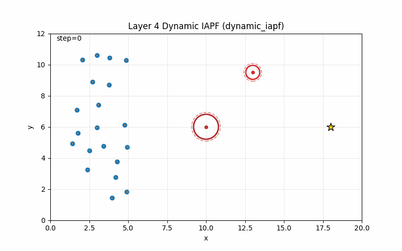
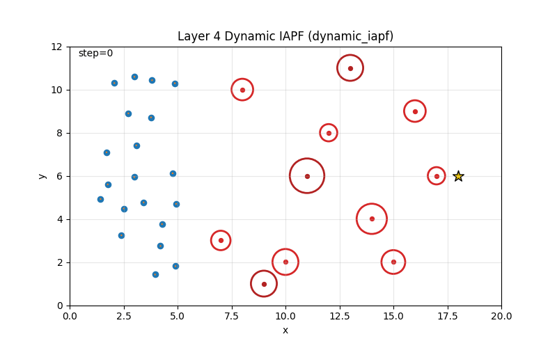
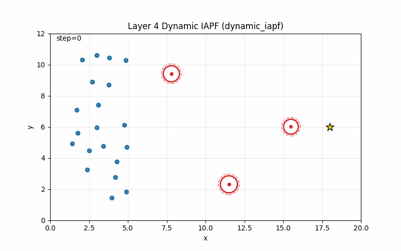
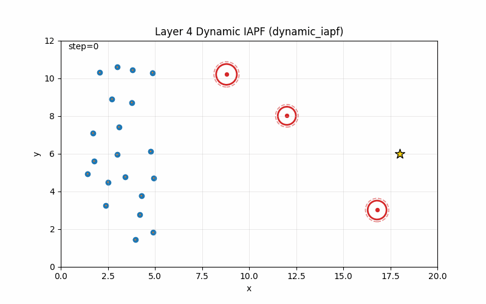
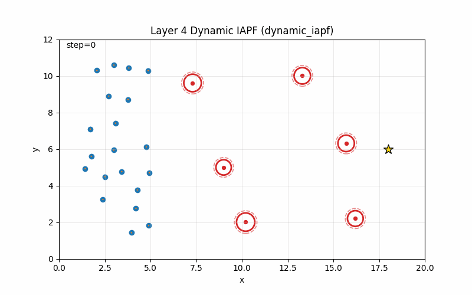
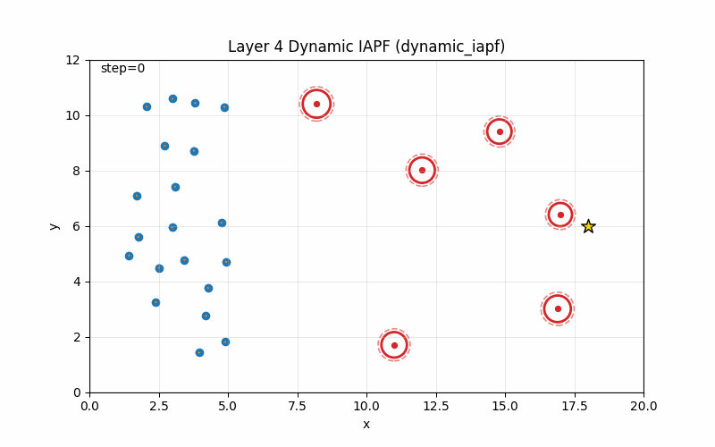

# Multi-Agent Flocking Pipeline: 当前实现、公式与实验结果

本文档描述 `/opt/data/private/Multi-Agent/flocking` 当前已经实现的多智能体 flocking 复现实验。实现目标是从一个轻量级二维多智能体仿真环境出发，逐层复现和扩展 Olfati-Saber flocking 框架，并在最后加入 Shao et al. 动态障碍物避障思想的工程化实现。

当前代码位于：

```text
/opt/data/private/Multi-Agent/flocking/mas_flocking/
```

当前已经完成的层级如下。

| Layer | 内容 | 控制律 | 当前状态 |
|---|---|---|---|
| Layer 0 | 二阶点质量多智能体仿真环境 | demo controller | 已实现 |
| Layer 1 | Olfati-Saber free-space alpha-agent flocking + agent-agent safety barrier | `u = u_alpha` | 已实现 |
| Layer 2 | gamma-agent 目标导航 + 目标吸引衰减 | `u = u_alpha + u_gamma` | 已实现 |
| Layer 3 | static beta-agent 静态圆形障碍物避障 | `u = u_alpha + u_beta + u_gamma` | 已实现 |
| Layer 4 | Shao-inspired dynamic IAPF 动态障碍物避障 + 复杂动态场景/故障模拟 | `u = u_alpha + u_beta + u_gamma + u_dyn` | 已实现 |

参考论文：

- `papers/Flocking_for_multi-agent_dynamic_systems_algorithms_and_theory.pdf`
- `papers/Dynamic_Obstacle-Avoidance_Algorithm_for_Multi-Robot_Flocking_Based_on_Improved_Artificial_Potential_Field.pdf`

需要注意：Layer 1 到 Layer 3 的主体仍然贴近 Olfati-Saber 的 alpha/beta/gamma-agent 分层思想；当前代码在 alpha 控制中额外加入了工程化 agent-agent hard-core safety barrier，在 gamma 控制中加入了靠近目标时的吸引衰减。Layer 4 是 Shao et al. 动态障碍物避障思想的工程化、预测式 IAPF 实现，不是对 Shao 原文所有速度融合公式的逐式完整复现。

---

## 1. 环境与运行方式

项目使用 Conda 环境：

```bash
conda create -n mas_flocking python=3.10
conda activate mas_flocking
pip install -r requirements.txt
```

或者使用仓库中的环境文件：

```bash
conda env create -f environment.yml
conda activate mas_flocking
```

单元测试：

```bash
python -m unittest discover -s tests -v
```

当前测试结果：`31 tests OK`。

---

## 2. 代码结构

```text
mas_flocking/
  __init__.py
  utils.py                         # 数组形状检查、向量裁剪等通用工具
  obstacles.py                     # CircleObstacle 静态/动态圆形障碍物
  simulator.py                     # FlockingEnv 二阶点质量仿真器
  controllers.py                   # Layer 0 基础 zero/goal PD 控制器
  metrics.py                       # 速度一致性、连通性、避障、目标距离等指标
  visualize.py                     # 轨迹图、动画、指标曲线绘制
  main.py                          # Layer 0 demo
  alpha_flocking.py                # Layer 1 alpha-agent 控制 + agent-agent safety barrier
  gamma_navigation.py              # Layer 2 gamma-agent 目标导航 + target decay
  beta_obstacle.py                 # Layer 3 beta-agent 静态障碍物避障
  dynamic_iapf.py                  # Layer 4 dynamic IAPF 动态障碍物避障
  layer1_free_flocking.py          # Layer 1 实验入口
  layer2_target_navigation.py      # Layer 2 实验入口
  layer3_static_obstacles.py       # Layer 3 实验入口
  layer4_dynamic_iapf.py           # Layer 4 实验入口

tests/
  test_layer0.py
  test_layer1_alpha.py
  test_layer2_gamma.py
  test_layer3_beta.py
  test_layer4_dynamic_iapf.py

outputs/
  animations/
  figures/
  logs/
```

整体设计原则是：

- `FlockingEnv` 只负责动力学、边界、障碍物状态推进，不把具体 flocking 控制律写进环境。
- 每个控制层单独放在一个模块中，方便后续做 ablation。
- 每个 demo 都输出轨迹图、指标曲线、CSV 日志和可选 GIF。
- Layer 1/2/3/4 的控制项可以直接相加，便于比较不同模块的贡献。

---

## 3. Layer 0: 基础多智能体仿真环境

### 3.1 状态与动力学

每个 agent 是二维二阶点质量模型：

$$
q_i \in \mathbb{R}^2, \quad p_i \in \mathbb{R}^2, \quad u_i \in \mathbb{R}^2
$$

其中：

- `q_i` 是位置；
- `p_i` 是速度；
- `u_i` 是控制输入，也可以理解为加速度。

连续模型：

$$
\dot q_i = p_i
$$

$$
\dot p_i = u_i
$$

当前代码使用 semi-implicit Euler 更新：

$$
\tilde u_i = \operatorname{clip}_{u_{max}}(u_i)
$$

$$
p_i(t+\Delta t) = \operatorname{clip}_{v_{max}}\left(p_i(t)+\tilde u_i\Delta t\right)
$$

$$
q_i(t+\Delta t)=q_i(t)+p_i(t+\Delta t)\Delta t
$$

对应代码：`mas_flocking/simulator.py` 中的 `FlockingEnv.step()`。

默认参数：

| 参数 | 默认值 |
|---|---:|
| `n_agents` | `30` |
| `dt` | `0.02` |
| `world_size` | `(20.0, 12.0)` |
| `v_max` | `3.0` |
| `u_max` | `8.0` |
| `boundary_mode` | `reflect` |

`boundary_mode` 支持：

| 模式 | 含义 |
|---|---|
| `reflect` | 碰到边界后反弹 |
| `clip` | 位置裁剪到边界，速度不反弹 |
| `none` | 不处理边界，适合目标迁移和避障实验 |

### 3.2 初始化方式

`FlockingEnv.reset(init_mode=...)` 支持：

| 模式 | 用途 |
|---|---|
| `random_left` | agent 初始化在地图左侧，适合目标迁移 |
| `random_center` | agent 初始化在地图中部，适合 free-space flocking |
| `custom` | 手工传入 `q0/p0`，适合单元测试 |

### 3.3 障碍物

障碍物由 `CircleObstacle` 表示：

```python
CircleObstacle(
    center=(x, y),
    radius=r,
    velocity=(vx, vy),
    dynamic=True or False,
)
```

动态障碍物会在 `env.step()` 中调用 `obstacle.step(...)` 随时间移动。

### 3.4 Layer 0 demo

运行：

```bash
python -m mas_flocking.main
```

输出：

- `outputs/figures/layer0_trajectories.png`
- `outputs/animations/layer0_demo.gif`
- `outputs/logs/layer0_metrics.csv`

轨迹图：


动画：


Layer 0 主要验证环境动力学、障碍物显示、指标记录和可视化链路，不作为正式 flocking 控制效果评价。

---

## 4. Layer 1: Olfati-Saber Free-Space Alpha-Agent Flocking

Layer 1 实现 Olfati-Saber Algorithm 1 中的 alpha-agent interaction terms：距离保持项加速度一致项。此层没有目标点，也没有障碍物。

控制律：

$$
u_i = u_i^\alpha
$$

### 4.1 Sigma norm

Olfati-Saber 使用光滑的 sigma norm：

$$
\|z\|_\sigma = \frac{\sqrt{1+\epsilon\|z\|^2}-1}{\epsilon}
$$

代码：`alpha_flocking.sigma_norm(...)`。

### 4.2 Smooth direction vector

两个 agent 之间的光滑方向向量为：

$$
n_{ij} = \frac{q_j-q_i}{\sqrt{1+\epsilon\|q_j-q_i\|^2}}
$$

代码：`alpha_flocking.sigma_unit_vectors(...)`。

### 4.3 Bump function

有限通信半径使用 smooth bump function：

$$
\rho_h(z)=
\begin{cases}
1, & 0 \le z < h \\
\frac{1}{2}\left(1+\cos\left(\pi\frac{z-h}{1-h}\right)\right), & h \le z \le 1 \\
0, & z > 1
\end{cases}
$$

代码：`alpha_flocking.bump_function(...)`。

### 4.4 Weighted adjacency

代码没有使用简单的硬邻接，而是使用论文中的 weighted proximity graph：

$$
r_\alpha = \|r\|_\sigma
$$

$$
a_{ij}(q)=\rho_h\left(\frac{\|q_j-q_i\|_\sigma}{r_\alpha}\right)
$$

并且强制：

$$
a_{ii}=0
$$

代码：`alpha_flocking.alpha_adjacency_matrix(...)`。

### 4.5 Action function

scalar helper：

$$
\sigma_1(z)=\frac{z}{\sqrt{1+z^2}}
$$

Olfati-Saber action function：

$$
\phi(z)=\frac{1}{2}\left((a+b)\sigma_1(z+c)+(a-b)\right)
$$

其中：

$$
c=\frac{|a-b|}{\sqrt{4ab}}
$$

alpha action：

$$
d_\alpha = \|d\|_\sigma
$$

$$
\phi_\alpha(z)=\rho_h\left(\frac{z}{r_\alpha}\right)\phi(z-d_\alpha)
$$

代码：`alpha_flocking.phi(...)` 和 `alpha_flocking.phi_alpha(...)`。

这里特别注意：实现中使用的是 `d_alpha = ||d||_sigma`，没有直接把欧氏距离 `d` 塞进 sigma-norm 变量里。这样平衡距离更符合论文写法。

### 4.6 Alpha control

Olfati-Saber 原始 alpha 控制由两部分组成：

$$
u_{i,OS}^\alpha = c_1^\alpha \sum_{j=1}^{N}\phi_\alpha(\|q_j-q_i\|_\sigma)n_{ij}
+ c_2^\alpha \sum_{j=1}^{N}a_{ij}(q)(p_j-p_i)
$$

第一项负责维持距离并形成 alpha-lattice；第二项负责速度一致性。

代码：`alpha_flocking.alpha_flocking_control(q, p, params)`。

### 4.7 Agent-Agent Safety Barrier

新 contribution 在 `alpha_flocking_control(...)` 中额外加入了 agent-agent hard-core safety barrier。这个项是当前工程实现的安全扩展，不属于 Olfati-Saber Algorithm 1 的原始 alpha 势函数。

对任意 agent pair：

$$
d_{ij}^{E}=\|q_i-q_j\|
$$

如果：

$$
d_{ij}^{E}<d_{safe}^{agent}
$$

则对 agent `i` 加入强排斥：

$$
u_{i}^{barrier}
=\sum_{\substack{j\ne i\\d_{ij}^{E}<d_{safe}^{agent}}}
k_{barrier}
\left(
\frac{1}{d_{ij}^{E}+\varepsilon_b}
-
\frac{1}{d_{safe}^{agent}}
\right)^2
\frac{q_i-q_j}{d_{ij}^{E}+\varepsilon_b}
$$

如果 `d_ij^E >= d_safe_agent`，该 pair 不触发 barrier。

最终当前实现中的 alpha 控制实际为：

$$
u_i^\alpha = u_{i,OS}^\alpha + u_i^{barrier}
$$

其中：

- `d_safe_agent` 是 agent-agent 硬安全距离阈值；
- `k_barrier` 是安全屏障排斥增益；
- `epsilon_b = 1e-12` 是代码中为了避免除零加入的数值保护。

这个扩展的作用是补足原始 alpha 势函数“柔性距离保持但没有硬安全边界”的问题。它会在 agent 过近时产生比普通 alpha repulsion 更强的排斥，当前 Layer 1/2/4 的结果中 `min_agent_distance` 已经被稳定推回到约 `0.28-0.30` 附近。

默认参数：

| 参数 | 默认值 | 含义 |
|---|---:|---|
| `epsilon` | `0.1` | sigma norm 平滑参数 |
| `h` | `0.2` | bump function 平滑区间 |
| `d` | `1.2` | 期望 agent-agent 距离 |
| `r` | `3.0` | sensing radius |
| `a` | `5.0` | action function 参数 |
| `b` | `5.0` | action function 参数 |
| `c1_alpha` | `1.0` | 距离保持项增益 |
| `c2_alpha` | `2.0` | 速度一致项增益 |
| `d_safe_agent` | `0.40` | agent-agent hard-core 安全距离阈值 |
| `k_barrier` | `5.0` | Layer 1/2 默认安全屏障排斥增益 |

### 4.8 Layer 1 demo

运行：

```bash
python -m mas_flocking.layer1_free_flocking --n-steps 1000 --skip-animation
```

生成 GIF：

```bash
python -m mas_flocking.layer1_free_flocking --n-steps 1000
```

输出：

- `outputs/figures/layer1/layer1_alpha_trajectories.png`
- `outputs/animations/layer1/layer1_alpha_flocking.gif`
- `outputs/logs/layer1/layer1_alpha_metrics.csv`

轨迹图：


动画：


### 4.9 Layer 1 结果

| 指标 | final | min | max | mean |
|---|---:|---:|---:|---:|
| velocity consensus error | `0.002490` | `0.002490` | `1.722054` | `0.176797` |
| min agent distance | `0.304097` | `0.294825` | `0.845809` | `0.346326` |
| lattice deviation energy | `0.207455` | `0.200261` | `1.074882` | `0.275087` |
| mean neighbor count | `15.000000` | `6.625000` | `15.000000` | `14.535125` |
| connected components | `1` | `1` | `1` | `1` |
| lambda_2 | `16.000000` | `2.101423` | `16.000000` | `15.011083` |

结果解读：

- 速度一致性最终降到 `0.002490`，说明 alpha 速度同步项工作正常。
- 连通分量始终为 `1`，说明当前初始化下 flock 没有 fragmentation。
- `lattice_deviation_energy` 明显下降并保持较低，说明距离调节项能形成较稳定的局部结构。
- 新增 safety barrier 把最小 agent-agent 距离从旧结果的约 `0.15` 提升到当前最小 `0.294825`，说明 agent-agent 安全边界明显改善。
- Layer 1 不包含 gamma-agent，因此不会主动向某个目标点移动。

---

## 5. Layer 2: Gamma-Agent Target Navigation

Layer 2 在 Layer 1 的基础上加入 gamma-agent 目标导航，对应 Olfati-Saber Algorithm 2 的思想。

总控制律：

$$
u_i = u_i^\alpha + u_i^\gamma
$$

默认目标点沿用 Layer 0 的地图目标：

$$
q_r = [18.0, 6.0]^T
$$

$$
p_r = [0.0, 0.0]^T
$$

即当前默认是 static gamma-agent。

### 5.1 Vector sigma saturation

gamma 项使用的是向量饱和函数，而不是 Layer 1 action function 中的 scalar `sigma_1`：

$$
\sigma_1^{vec}(z)=\frac{z}{\sqrt{1+\|z\|^2}}
$$

代码：`gamma_navigation.vector_sigma_1(...)`。

### 5.2 Gamma navigation control

位置误差与速度误差：

$$
e_q = q_i-q_r
$$

$$
e_p = p_i-p_r
$$

当前新 contribution 在 gamma 位置吸引项前加入 target decay：

$$
r_{decay}=2.4
$$

$$
s_i = 1-\exp\left(-\left(\frac{\|q_i-q_r\|}{r_{decay}}\right)^2\right)
$$

当 agent 离目标较远时，`s_i` 接近 `1`，gamma 位置吸引基本保持原强度；当 agent 已经靠近目标时，`s_i` 接近 `0`，位置吸引自动减弱。这可以减少 static gamma-agent 在终点附近持续把所有 agent 压缩到同一点的趋势。

当前控制项：

$$
u_i^\gamma = -c_1^\gamma s_i\sigma_1^{vec}(q_i-q_r) - c_2^\gamma(p_i-p_r)
$$

代码：`gamma_navigation.gamma_navigation_control(...)`。

注意：`r_decay = 2.4` 当前是代码中的固定值，不是 CLI 参数。

默认参数：

| 参数 | 默认值 |
|---|---:|
| `c1_gamma` | `1.0` |
| `c2_gamma` | `1.2` |

组合控制：

$$
u_i = u_i^\alpha + u_i^\gamma
$$

代码：`gamma_navigation.free_flocking_with_navigation_control(...)`。

### 5.3 Layer 2 demo

运行：

```bash
python -m mas_flocking.layer2_target_navigation --n-steps 2400 --skip-animation
```

生成 GIF：

```bash
python -m mas_flocking.layer2_target_navigation --n-steps 2400
```

输出：

- `outputs/figures/layer2/layer2_target_navigation_trajectories.png`
- `outputs/animations/layer2/layer2_target_navigation.gif`
- `outputs/logs/layer2/layer2_target_navigation_metrics.csv`

轨迹图：


动画：


### 5.4 Layer 2 结果

| 指标 | final | min | max | mean |
|---|---:|---:|---:|---:|
| mean goal distance | `0.832599` | `0.832599` | `15.252425` | `6.516423` |
| center-of-mass goal distance | `0.599691` | `0.599691` | `14.999907` | `6.454242` |
| velocity consensus error | `0.001705` | `0.001481` | `1.309051` | `0.103831` |
| min agent distance | `0.294225` | `0.267433` | `0.754724` | `0.298843` |
| lattice deviation energy | `0.218602` | `0.218129` | `0.970102` | `0.254486` |
| connected components | `1` | `1` | `1` | `1` |

结果解读：

- 相比 Layer 1，Layer 2 能够把 flock 往目标点 `[18, 6]` 推进。
- 2400 steps 下平均目标距离从约 `15.25` 降到 `0.83`，目标导航有效。
- 速度一致性最终仍然很好，说明 alpha velocity consensus 和 gamma damping 能共同稳定速度。
- 新增 target decay 减弱了终点附近的位置吸引，配合 alpha safety barrier 后，`min_agent_distance` 的最小值保持在 `0.267433`，明显好于旧实现中的终点压缩。

---

## 6. Layer 3: Static Beta-Agent Obstacle Avoidance

Layer 3 在 Layer 2 的基础上加入静态障碍物避障，对应 Olfati-Saber Algorithm 3 中的 beta-agent 思路。

总控制律：

$$
u_i = u_i^\alpha + u_i^\beta + u_i^\gamma
$$

默认障碍物使用 Layer 0 示例中的两个圆形障碍物，并冻结为静态：

| obstacle | center | radius | velocity | dynamic |
|---|---|---:|---|---|
| 1 | `(10.0, 6.0)` | `0.8` | `(0.0, 0.0)` | `False` |
| 2 | `(13.0, 9.5)` | `0.45` | `(0.0, 0.0)` | `False` |

### 6.1 Inflated obstacle

为了考虑 agent 自身半径，代码使用膨胀障碍物半径：

$$
R_{eff}=R_{obs}+R_{agent}
$$

默认：

$$
R_{agent}=0.12
$$

agent 到障碍物的 signed clearance：

$$
d_{clear}=\|q_i-o\|-R_{eff}
$$

代码：`beta_obstacle.obstacle_clearances(...)`。

### 6.2 Beta-agent projection

对于圆形障碍物，beta-agent 是 agent 在障碍物膨胀边界上的投影点。

障碍物中心为 `o`，单位外法向为：

$$
n_i = \frac{q_i-o}{\|q_i-o\|}
$$

投影点：

$$
\hat q_i = o + R_{eff} n_i
$$

代码：`beta_obstacle.project_to_obstacle_boundary(...)`。

### 6.3 One-sided beta repulsion

当前实现没有使用会吸引 agent 靠近障碍物的双向势函数，而是使用 one-sided repulsive beta action。先对 clearance 做 scalar sigma norm：

$$
\|d_{clear}\|_\sigma = \frac{\sqrt{1+\epsilon d_{clear}^2}-1}{\epsilon}
$$

然后定义：

$$
r_{\beta,\sigma}=\|r_\beta\|_\sigma
$$

$$
\eta = \frac{\|d_{clear}\|_\sigma}{r_{\beta,\sigma}}
$$

$$
\phi_\beta(d_{clear}) = -\rho_h(\eta)(1-\operatorname{clip}(\eta,0,1))
$$

这里 `phi_beta <= 0`，并且超过影响半径后为 `0`。

### 6.4 Beta velocity projection

原始 pipeline 曾经把静态障碍物 beta-agent 速度简化为 `p_hat = 0`。当前代码默认使用更接近 Olfati-Saber beta-agent 几何思想的切平面投影速度：

$$
\hat p_i = p_i - (p_i^T n_i)n_i
$$

这样只抑制朝向障碍物的法向速度，尽量保留切向滑行能力，绕障会更自然。

也保留消融模式：

```python
beta_velocity_mode="zero"
```

### 6.5 Beta control

代码中的 beta 控制形式为：

$$
u_i^\beta = c_1^\beta \phi_\beta(d_{clear})\hat n_i + c_2^\beta w_i(\hat p_i-p_i)
$$

其中 `hat n_i` 在代码中是从 agent 指向障碍物边界投影点的 inward direction。由于 `phi_beta` 是负数，所以第一项实际产生远离障碍物的排斥力。

代码：`beta_obstacle.beta_obstacle_control(...)`。

默认参数类：

| 参数 | 默认值 |
|---|---:|
| `epsilon` | `0.1` |
| `h` | `0.2` |
| `r_beta` | `2.5` |
| `c1_beta` | `8.0` |
| `c2_beta` | `3.0` |
| `agent_radius` | `0.12` |
| `beta_velocity_mode` | `projected` |

Layer 3 demo 中的 CLI 默认参数使用了安全与到达速度之间的折中调参。旧参数 `c1_beta=3.0, c2_beta=2.0` 会在障碍物边界附近出现擦边式碰撞；过大的 `r_beta` 又会让队伍绕得太保守、到达变慢。当前默认值如下：

| 参数 | demo 默认值 |
|---|---:|
| `r_beta` | `1.5` |
| `c1_beta` | `6.0` |
| `c2_beta` | `3.0` |
| `c1_gamma` | `1.5` |
| `d_safe_agent` | `0.40` |
| `k_barrier` | `15.0` |

### 6.6 Layer 3 demo

运行：

```bash
python -m mas_flocking.layer3_static_obstacles --n-steps 2400 --skip-animation
```

生成 GIF：

```bash
python -m mas_flocking.layer3_static_obstacles --n-steps 2400
```

输出：

- `outputs/figures/layer3/layer3_static_obstacles_beta_trajectories.png`
- `outputs/animations/layer3/layer3_static_obstacles_beta.gif`
- `outputs/logs/layer3/layer3_static_obstacles_beta_metrics.csv`

轨迹图：


动画：


### 6.7 Layer 3 结果

| 指标 | final | min | max | mean |
|---|---:|---:|---:|---:|
| mean goal distance | `0.797184` | `0.797184` | `15.313787` | `7.741008` |
| center-of-mass goal distance | `0.518314` | `0.518314` | `15.075281` | `7.692037` |
| velocity consensus error | `0.002190` | `0.002190` | `1.443429` | `0.105311` |
| min agent distance | `0.330271` | `0.306200` | `0.760161` | `0.333306` |
| min obstacle clearance | `4.280551` | `0.421387` | `5.063436` | `1.933564` |
| collision count | `0` | `0` | `0` | `0` |
| total collision steps | `0` | `0` | `0` | `0` |
| lattice deviation energy | `0.216924` | `0.216924` | `1.059090` | `0.254398` |
| connected components | `1` | `1` | `1` | `1` |

结果解读：

- 当前 Layer 3 demo 中 agent-agent safety barrier 有效，`min_agent_distance` 的最小值保持在 `0.306200`。
- 静态障碍物最小 clearance 为 `0.421387`，`collision_count = 0`，说明 agent 物理边界没有进入膨胀障碍物边界。
- 2400 steps 下 mean goal distance 降到 `0.797184`，说明更强 beta 避障没有导致队伍卡在中途。
- 这组参数是安全和到达效率的折中：比旧 beta 参数更强，能消除擦边碰撞；但没有把 `r_beta` 放得过大，因此仍能完整到达目标附近。

---

## 7. Layer 4: Shao-Inspired Dynamic IAPF Dynamic Obstacle Avoidance

Layer 4 在 Layer 3 基础上加入动态障碍物预测避障项。总控制律为：

$$
u_i = u_i^\alpha + u_i^\beta + u_i^\gamma + u_i^{dyn}
$$

这里：

- `u_alpha` 负责局部队形和速度一致性；
- `u_beta` 负责当前几何位置上的障碍物安全兜底；
- `u_gamma` 负责目标导航；
- `u_dyn` 负责根据相对速度预测动态障碍物风险，提前避让。

Layer 4 默认场景现在使用和 Layer 3 相同的初始障碍物几何，用于公平对比：

| obstacle | initial center | radius | velocity | dynamic |
|---|---|---:|---|---|
| 1 | `(10.0, 6.0)` | `0.8` | `(0.0, 0.0)` | `False` |
| 2 | `(13.0, 9.5)` | `0.45` | `(0.0, -0.35)` | `True` |

也就是说，第二个障碍物从 Layer 3 相同的初始位置开始，但在 Layer 4 中向下移动。

### 7.1 Closest point of approach

对每个 agent-obstacle pair，设障碍物中心为 `o_k`，速度为 `v_k`：

$$
r_i = q_i-o_k
$$

$$
v_{rel}=p_i-v_k
$$

最近接近时间 CPA：

$$
t^* = \operatorname{clip}\left(-\frac{r_i^T v_{rel}}{\|v_{rel}\|^2+\epsilon},0,T_p\right)
$$

预测相对位置：

$$
r_{pred}=r_i+t^*v_{rel}
$$

预测 clearance：

$$
d_{pred}=\|r_{pred}\|-R_{obs}-R_{agent}-d_{safe}
$$

这里 `R_agent` 使用 CLI 参数 `agent_radius`，使动态预测避障和实际碰撞指标使用同一个 agent 物理半径口径。

closing speed：

$$
s_{close}=\max\left(0,-\frac{r_i^T v_{rel}}{\|r_i\|+\epsilon}\right)
$$

代码：`dynamic_iapf.closest_approach(...)`。

### 7.2 Dynamic risk

动态风险权重：

$$
w_{risk}=\max\left(0,\frac{1}{\max(d_{pred},0)+\epsilon}-\frac{1}{d_{inf}}\right)
$$

当预测 clearance 大于影响距离时：

$$
w_{risk}=0, \quad d_{pred}\ge d_{inf}
$$

代码中还会对风险做上界裁剪，避免预测 clearance 接近 0 时控制量爆炸。

代码：`dynamic_iapf.dynamic_obstacle_risk(...)`。

### 7.3 Inhibiting velocity

单位预测排斥方向：

$$
n_{pred}=\frac{r_{pred}}{\|r_{pred}\|+\epsilon}
$$

切向方向：

$$
\tau = [-n_{pred,y}, n_{pred,x}]^T
$$

切向方向的符号由目标方向选择，使其更倾向于绕向目标侧：

$$
\tau \leftarrow \operatorname{sign}(\tau^T(q_r-q_i))\tau
$$

动态障碍物 inhibiting velocity：

$$
v_i^{obs} = \sum_k w_{risk}\left(k_{repulse}n_{pred} + k_{velocity}s_{close}n_{pred} + k_{tangent}\tau\right)
$$

最后裁剪：

$$
v_i^{obs} \leftarrow \operatorname{clip}_{v_{obs,max}}(v_i^{obs})
$$

代码：`dynamic_iapf.dynamic_inhibiting_velocity(...)`。

### 7.4 Dynamic IAPF control

当前实现没有使用 `k_track(v_obs-p_i)` 这种形式，因为在无风险时它容易错误阻尼所有 agent 的速度。当前实现只把动态避障速度作为额外避障控制增量：

$$
u_i^{dyn}=k_{obs}v_i^{obs}
$$

代码：`dynamic_iapf.dynamic_iapf_control(...)`。

组合控制：

$$
u_i = u_i^\alpha + u_i^\beta + u_i^\gamma + u_i^{dyn}
$$

代码：`dynamic_iapf.flocking_with_dynamic_iapf_control(...)`。

默认参数：

| 参数 | 默认值 | 含义 |
|---|---:|---|
| `prediction_horizon` | `3.0` | CPA 预测时间窗 |
| `influence_distance` | `3.0` | 动态风险影响距离 |
| `safe_distance` | `0.35` | 预测安全距离 |
| `k_repulse` | `1.2` | 预测排斥速度增益 |
| `k_velocity` | `0.8` | closing-speed 增益 |
| `k_tangent` | `0.6` | 切向绕行增益 |
| `k_obs` | `1.5` | inhibiting velocity 到控制输入的增益 |
| `max_obs_speed` | `2.0` | 动态避障速度上限 |
| `agent_radius` | `0.12` | 动态预测 clearance 中使用的 agent 物理半径 |
| `use_tangent` | `True` | 是否启用切向绕行 |
| `d_safe_agent` | `0.40` | 继承自 alpha 控制的 agent-agent 安全距离 |
| `k_barrier` | `20.0` | Layer 4 默认 agent-agent safety barrier 增益 |

### 7.5 Layer 4 method 选项

`layer4_dynamic_iapf.py` 支持不同 method：

| method | 控制律 | 用途 |
|---|---|---|
| `dynamic_iapf` | `alpha + beta + gamma + dyn` | 默认方法 |
| `static_beta` | `alpha + beta + gamma` | 把动态障碍物只当当前位置静态障碍处理 |
| `no_tangent` | `alpha + beta + gamma + dyn` 但去掉切向项 | 动态 IAPF 消融 |
| `no_avoidance` | `alpha + gamma` | 无障碍物避障 baseline |

### 7.6 Layer 4 scenario 与故障模拟

`layer4_dynamic_iapf.py` 当前支持以下 scenario：

| scenario | 含义 |
|---|---|
| `layer3_same` | 和 Layer 3 几何一致，一静一动，用于公平对比 |
| `single_crossing` | 单个横穿动态障碍物 |
| `layer0_dynamic` | Layer 0 风格动态障碍物 |
| `multi_dynamic` | 多动态障碍物 |
| `complex_dynamic` | 新增复杂场景，包含 8 个动态圆形障碍物和 3 个静态圆形障碍物 |
| `multi_curved_dynamic` | 新增 3 个 scripted 曲线运动障碍物，用于测试非直线动态预测避障 |
| `mixed_accel_dynamic` | 新增 2 个变速直线障碍物 + 1 个变速曲线障碍物，用于测试速度变化下的短时预测避障 |
| `multi_curved_dynamic_v2` | 多曲线动态障碍物场景 v2，基于 `multi_curved_dynamic` 将障碍物数量翻倍到 6 个，并提高曲线速度变化幅度 |
| `mixed_accel_dynamic_v2` | 混合变速动态障碍物场景 v2，基于 `mixed_accel_dynamic` 翻倍为 4 个变速直线 + 2 个变速曲线障碍物，并增大加速度/曲线扰动 |

为了支持曲线和变速障碍物，同时不影响旧实验，代码新增了 `ScriptedCircleObstacle`，原来的 `CircleObstacle` 恒定速度模型保持不变。旧场景 `layer3_same`、`single_crossing`、`layer0_dynamic`、`multi_dynamic`、`complex_dynamic` 仍然走 `CircleObstacle.step(...)`；只有新场景使用 scripted trajectory。

scripted obstacle 的轨迹写成：

$$
o(t)=o_0+v_0t+\frac{1}{2}at^2+A\left[\sin(\omega t+\phi)-\sin(\phi)\right]+C(t)
$$

其中 `o(t)` 是障碍物中心，`o_0` 是初始中心，`v_0` 是基础速度，`a` 是常加速度，`A` 是 x/y 方向正弦扰动幅值，`\omega` 是角频率，`\phi` 是相位，`C(t)` 是可选圆周扰动项。对应瞬时速度为：

$$
\dot o(t)=v_0+at+A\omega\cos(\omega t+\phi)+\dot C(t)
$$

Layer 4 的 dynamic IAPF 仍然只读取每个障碍物当前 `center` 和 `velocity`，因此 scripted obstacle 可以无缝复用已有 CPA 短时预测、风险权重和切向避障逻辑。

新增故障模拟参数：

| 参数 | 默认值 | 含义 |
|---|---:|---|
| `fail_count` | `0` | 随机选取多少个 agent 在仿真中故障 |
| `fail_step` | `400` | 从第多少步开始让故障 agent 失去控制 |

当 `step_idx >= fail_step` 且 `fail_count > 0` 时，代码会把故障 agent 的控制输入置零，并将其速度乘以 `0.95` 做快速衰减：

$$
u_i = 0,\quad p_i \leftarrow 0.95p_i
$$

同时新增 `active_mean_goal_distance` 指标，只统计非故障 agent 到目标点的平均距离，避免故障 agent 停在路上后污染活跃群体的到达评价。

### 7.7 Layer 4 demo

当前 2500-step 结果命令：

```bash
python -m mas_flocking.layer4_dynamic_iapf --scenario layer3_same --method dynamic_iapf --n-steps 2500
```

最终 GIF 按脚本当前命名规则保存为：

```text
outputs/animations/layer4/layer4_layer3_same_dynamic_iapf.gif
```

输出：

- `outputs/figures/layer4/layer4_layer3_same_dynamic_iapf_trajectories.png`
- `outputs/animations/layer4/layer4_layer3_same_dynamic_iapf.gif`
- `outputs/logs/layer4/layer4_layer3_same_dynamic_iapf_metrics.csv`
- `outputs/figures/layer4/layer4_layer3_same_dynamic_iapf/*.png`

新增复杂动态场景输出：

- `outputs/figures/layer4/layer4_complex_dynamic_dynamic_iapf_trajectories.png`
- `outputs/animations/layer4/layer4_complex_dynamic_dynamic_iapf.gif`
- `outputs/logs/layer4/layer4_complex_dynamic_dynamic_iapf_metrics.csv`
- `outputs/figures/layer4/layer4_complex_dynamic_dynamic_iapf/*.png`

复杂动态场景当前使用 `2500` steps 作为正式结果，确保队伍绕过多动态/静态障碍物后完整到达目标附近。

新增 scripted 动态场景输出：

- `outputs/figures/layer4/layer4_multi_curved_dynamic_dynamic_iapf_trajectories.png`
- `outputs/animations/layer4/layer4_multi_curved_dynamic_dynamic_iapf.gif`
- `outputs/logs/layer4/layer4_multi_curved_dynamic_dynamic_iapf_metrics.csv`
- `outputs/figures/layer4/layer4_multi_curved_dynamic_dynamic_iapf/*.png`
- `outputs/figures/layer4/layer4_mixed_accel_dynamic_dynamic_iapf_trajectories.png`
- `outputs/animations/layer4/layer4_mixed_accel_dynamic_dynamic_iapf.gif`
- `outputs/logs/layer4/layer4_mixed_accel_dynamic_dynamic_iapf_metrics.csv`
- `outputs/figures/layer4/layer4_mixed_accel_dynamic_dynamic_iapf/*.png`
- `outputs/figures/layer4/layer4_multi_curved_dynamic_v2_dynamic_iapf_trajectories.png`
- `outputs/animations/layer4/layer4_multi_curved_dynamic_v2_dynamic_iapf.gif`
- `outputs/logs/layer4/layer4_multi_curved_dynamic_v2_dynamic_iapf_metrics.csv`
- `outputs/figures/layer4/layer4_multi_curved_dynamic_v2_dynamic_iapf/*.png`
- `outputs/figures/layer4/layer4_mixed_accel_dynamic_v2_dynamic_iapf_trajectories.png`
- `outputs/animations/layer4/layer4_mixed_accel_dynamic_v2_dynamic_iapf.gif`
- `outputs/logs/layer4/layer4_mixed_accel_dynamic_v2_dynamic_iapf_metrics.csv`
- `outputs/figures/layer4/layer4_mixed_accel_dynamic_v2_dynamic_iapf/*.png`

轨迹图：


动画：



复杂动态场景动画：



多曲线动态障碍物场景动画：



混合变速动态障碍物场景动画：



多曲线动态障碍物场景 v2 动画：



混合变速动态障碍物场景 v2 动画：



### 7.8 Layer 4 结果

Layer 4 当前使用 `2500` steps，目标是让 flock 足够接近最终目标点。正式动态场景现在使用完全一致的评测 schema：CSV 中除 `step` 外固定记录 `25` 个指标。这个 schema 是两个例子原有指标的并集，再加上优先补充的 6 类论文常用指标：

- `cohesion_radius`
- `relative_connectivity`
- `normalized_velocity_mismatch`
- `average_flocking_error`
- `formation_recovery_step/time`
- `mean_speed/max_speed/speed_std`

代码中用 `LAYER4_METRIC_KEYS` 固定字段顺序，`tests/test_layer4_dynamic_iapf.py` 也会短跑 `layer3_same`、`complex_dynamic`、`multi_curved_dynamic`、`mixed_accel_dynamic`、`multi_curved_dynamic_v2` 和 `mixed_accel_dynamic_v2` 来验证六个场景的指标数量和项目完全一致。

默认动态场景 `layer3_same` 的 2500-step 正式结果：

| 指标 | final | min | max | mean |
|---|---:|---:|---:|---:|
| mean goal distance | `0.872356` | `0.872356` | `14.951042` | `8.029572` |
| active mean goal distance | `0.872356` | `0.872356` | `14.951042` | `8.029572` |
| center-of-mass goal distance | `0.662830` | `0.662830` | `14.668973` | `7.988276` |
| velocity consensus error | `0.002873` | `0.002873` | `1.223715` | `0.107998` |
| normalized velocity mismatch | `0.000437` | `0.000033` | `0.996298` | `0.064877` |
| mean speed | `0.177490` | `0.108607` | `1.603258` | `0.808622` |
| max speed | `0.187000` | `0.163684` | `2.439705` | `0.899693` |
| speed std | `0.002977` | `0.002977` | `0.509665` | `0.046433` |
| min agent distance | `0.337703` | `0.317902` | `0.754539` | `0.340384` |
| cohesion radius | `0.827433` | `0.827433` | `4.779419` | `1.063103` |
| min obstacle clearance | `5.369539` | `0.419495` | `5.369539` | `1.864775` |
| collision count | `0` | `0` | `0` | `0` |
| total collision steps | `0` | `0` | `0` | `0` |
| total collision count | `0` | `0` | `0` | `0` |
| active dynamic risk count | `0` | `0` | `40` | `20.640400` |
| min predicted obstacle clearance | `5.015529` | `-1.269694` | `5.015529` | `0.957331` |
| control effort | `0.006458` | `0.000402` | `86.122589` | `0.515829` |
| lattice deviation energy | `0.216899` | `0.216899` | `0.933457` | `0.254293` |
| average flocking error | `27.428630` | `0.000000` | `27.553977` | `26.181075` |
| formation recovery step | `2151` | `-1` | `2151` | `299.419200` |
| formation recovery time | `21.510000` | `-1` | `21.510000` | `2.142396` |
| mean neighbor count | `19.000000` | `7.600000` | `19.000000` | `18.487440` |
| connected components | `1` | `1` | `1` | `1` |
| lambda_2 | `20.000000` | `0.714711` | `20.000000` | `18.817974` |
| relative connectivity | `1.000000` | `1.000000` | `1.000000` | `1.000000` |

结果解读：

- 最终平均目标距离为 `0.872356`，质心到目标距离为 `0.662830`，说明 flock 基本到达目标点附近。
- `collision_count = 0`、`total_collision_steps = 0`，说明动态障碍物与静态障碍物都没有发生碰撞。
- `active_dynamic_risk_count` 的最大值为 `40`，说明动态障碍物穿越路径时，dynamic IAPF 确实被激活。
- `min_predicted_obstacle_clearance` 最小值为 `-1.269694`，这表示某些时刻 CPA 预测如果不避让会发生危险接近；实际 `min_obstacle_clearance` 最小仍为 `0.419495`，说明动态避障项起到了提前规避作用。
- `min_agent_distance` 最小值保持在 `0.317902`，说明新增 agent-agent safety barrier 在动态避障场景下也有效。
- `formation_recovery_step = 2151`，对应 `21.51s`，表示动态风险结束后，局部 lattice energy 和 normalized velocity mismatch 首次同时回到阈值内。

复杂动态场景 `complex_dynamic` 的 2500-step 正式结果：

| 指标 | final | min | max | mean |
|---|---:|---:|---:|---:|
| mean goal distance | `0.708530` | `0.695889` | `14.951050` | `6.494983` |
| active mean goal distance | `0.708530` | `0.695889` | `14.951050` | `6.494983` |
| center-of-mass goal distance | `0.270736` | `0.197644` | `14.668981` | `6.363639` |
| velocity consensus error | `0.001994` | `0.001994` | `1.216429` | `0.110316` |
| normalized velocity mismatch | `0.000271` | `0.000140` | `0.996516` | `0.076476` |
| mean speed | `0.144893` | `0.103902` | `1.870764` | `0.746146` |
| max speed | `0.147123` | `0.111544` | `2.492714` | `0.840873` |
| speed std | `0.001561` | `0.001561` | `0.524577` | `0.049817` |
| min agent distance | `0.339459` | `0.318446` | `0.754539` | `0.343679` |
| cohesion radius | `0.822131` | `0.821030` | `4.779430` | `1.048614` |
| min obstacle clearance | `2.458181` | `0.028963` | `4.156591` | `2.255581` |
| collision count | `0` | `0` | `0` | `0` |
| total collision steps | `0` | `0` | `0` | `0` |
| total collision count | `0` | `0` | `0` | `0` |
| active dynamic risk count | `17` | `0` | `104` | `43.422800` |
| min predicted obstacle clearance | `1.609175` | `-1.069191` | `3.772613` | `1.253904` |
| control effort | `0.000276` | `0.000276` | `86.681237` | `0.537581` |
| lattice deviation energy | `0.216489` | `0.216370` | `0.933455` | `0.254086` |
| average flocking error | `28.472705` | `0.011378` | `28.648328` | `27.233624` |
| formation recovery step | `1572` | `-1` | `1572` | `582.897600` |
| formation recovery time | `15.720000` | `-1` | `15.720000` | `5.206464` |
| mean neighbor count | `19.000000` | `7.600000` | `19.000000` | `18.493280` |
| connected components | `1` | `1` | `1` | `1` |
| lambda_2 | `20.000000` | `0.714711` | `20.000000` | `18.835314` |
| relative connectivity | `1.000000` | `1.000000` | `1.000000` | `1.000000` |

复杂场景结果解读：

- 8 个动态障碍物和 3 个静态障碍物混合场景下，系统仍然保持 `collision_count = 0`。
- 最小真实障碍物 clearance 为 `0.028963`，说明存在非常贴近的安全通过，但没有发生 agent 边界与膨胀障碍物边界交叉。
- 2500 steps 后 mean goal distance 降到 `0.708530`，说明复杂场景也完成了从左侧出发、绕障并到达目标附近的完整流程。
- `active_dynamic_risk_count` 最大值达到 `104`，说明复杂场景确实比默认动态场景产生更密集的动态风险交互。
- `formation_recovery_step = 1572`，对应 `15.72s`，说明复杂场景在当前恢复判据下也能重新回到可接受 flocking 状态。

多曲线动态场景 `multi_curved_dynamic` 的 2500-step 正式结果：

| 指标 | final | min | max | mean |
|---|---:|---:|---:|---:|
| mean goal distance | `0.693434` | `0.686647` | `14.951043` | `3.798759` |
| active mean goal distance | `0.693434` | `0.686647` | `14.951043` | `3.798759` |
| center-of-mass goal distance | `0.156068` | `0.074444` | `14.668974` | `3.510175` |
| velocity consensus error | `0.000956` | `0.000937` | `1.225166` | `0.106551` |
| normalized velocity mismatch | `0.000220` | `0.000196` | `0.996391` | `0.062887` |
| mean speed | `0.075057` | `0.013749` | `2.330282` | `0.675656` |
| max speed | `0.076506` | `0.015202` | `2.462368` | `0.762708` |
| speed std | `0.000807` | `0.000632` | `0.509299` | `0.046088` |
| min agent distance | `0.340364` | `0.317639` | `0.754539` | `0.345930` |
| cohesion radius | `0.825959` | `0.825724` | `4.779419` | `1.046450` |
| min obstacle clearance | `2.993661` | `0.524788` | `4.475940` | `3.156599` |
| collision count | `0` | `0` | `0` | `0` |
| total collision steps | `0` | `0` | `0` | `0` |
| total collision count | `0` | `0` | `0` | `0` |
| active dynamic risk count | `12.000000` | `0.000000` | `60.000000` | `14.961600` |
| min predicted obstacle clearance | `1.923421` | `-0.111500` | `4.125936` | `2.327112` |
| control effort | `0.000205` | `0.000007` | `86.353581` | `0.593642` |
| lattice deviation energy | `0.216262` | `0.216048` | `0.933454` | `0.253531` |
| average flocking error | `28.459333` | `0.011372` | `28.715518` | `27.198921` |
| formation recovery step | `898` | `-1` | `898` | `575.079200` |
| formation recovery time | `8.980000` | `-1.000000` | `8.980000` | `5.395184` |
| mean neighbor count | `19.000000` | `7.600000` | `19.000000` | `18.486760` |
| connected components | `1` | `1` | `1` | `1` |
| lambda_2 | `20.000000` | `0.714711` | `20.000000` | `18.813993` |
| relative connectivity | `1.000000` | `1.000000` | `1.000000` | `1.000000` |

多曲线场景结果解读：

- 3 个障碍物使用正弦横摆/纵摆和圆周扰动，轨迹不再是恒定速度直线，但 dynamic IAPF 仍能通过当前瞬时速度做短时 CPA 预测。
- `collision_count = 0`、`total_collision_steps = 0`，最小真实 obstacle clearance 为 `0.524788`，比复杂动态场景更宽裕。
- 最终 mean goal distance 为 `0.693434`，COM goal distance 为 `0.156068`，说明队伍绕过曲线运动障碍物后完整到达目标附近。
- `active_dynamic_risk_count` 最大值为 `60`，说明曲线障碍物确实进入了 flock 的预测风险区间。
- `formation_recovery_step = 898`，对应 `8.98s`，是当前六个正式动态场景中恢复较快的一组。

混合变速动态场景 `mixed_accel_dynamic` 的 2500-step 正式结果：

| 指标 | final | min | max | mean |
|---|---:|---:|---:|---:|
| mean goal distance | `0.692415` | `0.692415` | `14.951042` | `5.130846` |
| active mean goal distance | `0.692415` | `0.692415` | `14.951042` | `5.130846` |
| center-of-mass goal distance | `0.142291` | `0.142291` | `14.668973` | `4.973497` |
| velocity consensus error | `0.000928` | `0.000726` | `1.223194` | `0.105127` |
| normalized velocity mismatch | `0.000246` | `0.000033` | `0.996308` | `0.062048` |
| mean speed | `0.068042` | `0.035349` | `1.545277` | `0.758771` |
| max speed | `0.070146` | `0.037145` | `2.453522` | `0.850332` |
| speed std | `0.000956` | `0.000598` | `0.509448` | `0.046513` |
| min agent distance | `0.339756` | `0.317838` | `0.754539` | `0.345443` |
| cohesion radius | `0.826882` | `0.826882` | `4.779419` | `1.049086` |
| min obstacle clearance | `3.777267` | `1.079377` | `5.103278` | `3.071978` |
| collision count | `0` | `0` | `0` | `0` |
| total collision steps | `0` | `0` | `0` | `0` |
| total collision count | `0` | `0` | `0` | `0` |
| active dynamic risk count | `11.000000` | `0.000000` | `42.000000` | `15.937600` |
| min predicted obstacle clearance | `2.087490` | `0.729375` | `4.753274` | `2.233972` |
| control effort | `0.001232` | `0.000036` | `86.140261` | `0.457971` |
| lattice deviation energy | `0.216179` | `0.216042` | `0.933457` | `0.253285` |
| average flocking error | `28.456590` | `0.011359` | `28.547325` | `27.191529` |
| formation recovery step | `1703` | `-1` | `1703` | `542.235200` |
| formation recovery time | `17.030000` | `-1.000000` | `17.030000` | `4.747964` |
| mean neighbor count | `19.000000` | `7.600000` | `19.000000` | `18.485680` |
| connected components | `1` | `1` | `1` | `1` |
| lambda_2 | `20.000000` | `0.714711` | `20.000000` | `18.811789` |
| relative connectivity | `1.000000` | `1.000000` | `1.000000` | `1.000000` |

混合变速场景结果解读：

- 该场景包含 2 个带常加速度的直线障碍物和 1 个带加速度 + 正弦扰动的曲线障碍物，用于检查障碍物瞬时速度变化时 CPA 风险预测是否仍然可用。
- `collision_count = 0`、`total_collision_steps = 0`，最小真实 obstacle clearance 为 `1.079377`，在 v1 scripted 场景中安全裕度最大。
- 最终 mean goal distance 为 `0.692415`，COM goal distance 为 `0.142291`，说明变速障碍物没有阻止 flock 完整到达目标附近。
- `min_predicted_obstacle_clearance` 最小值为 `0.729375`，没有出现负值，说明当前参数下预测风险较温和。
- `formation_recovery_step = 1703`，对应 `17.03s`，恢复时间介于默认动态场景和复杂动态场景之间。

多曲线动态障碍物场景 v2 `multi_curved_dynamic_v2` 的 2500-step 正式结果：

| 指标 | final | min | max | mean |
|---|---:|---:|---:|---:|
| mean goal distance | `0.686644` | `0.684717` | `14.951045` | `3.496076` |
| active mean goal distance | `0.686644` | `0.684717` | `14.951045` | `3.496076` |
| center-of-mass goal distance | `0.062706` | `0.035305` | `14.668977` | `3.087146` |
| velocity consensus error | `0.000677` | `0.000646` | `1.226537` | `0.109244` |
| normalized velocity mismatch | `0.010318` | `0.000179` | `0.996550` | `0.150107` |
| mean speed | `0.007814` | `0.004306` | `2.485453` | `0.659334` |
| max speed | `0.009090` | `0.006964` | `2.500000` | `0.750039` |
| speed std | `0.000570` | `0.000562` | `0.508567` | `0.047701` |
| min agent distance | `0.340406` | `0.313927` | `0.754539` | `0.344402` |
| cohesion radius | `0.827204` | `0.823401` | `4.779419` | `1.049935` |
| min obstacle clearance | `4.221106` | `0.131954` | `5.251676` | `3.302927` |
| collision count | `0` | `0` | `0` | `0` |
| total collision steps | `0` | `0` | `0` | `0` |
| total collision count | `0` | `0` | `0` | `0` |
| active dynamic risk count | `5.000000` | `0.000000` | `120.000000` | `23.872400` |
| min predicted obstacle clearance | `2.620799` | `-0.640497` | `4.799789` | `2.394088` |
| control effort | `0.000210` | `0.000000` | `86.618469` | `0.856400` |
| lattice deviation energy | `0.215991` | `0.215941` | `0.933450` | `0.253635` |
| average flocking error | `28.448257` | `0.011389` | `28.778149` | `27.194381` |
| formation recovery step | `1044` | `-1` | `1044` | `607.608000` |
| formation recovery time | `10.440000` | `-1.000000` | `10.440000` | `5.662656` |
| mean neighbor count | `19.000000` | `7.600000` | `19.000000` | `18.488200` |
| connected components | `1` | `1` | `1` | `1` |
| lambda_2 | `20.000000` | `0.714711` | `20.000000` | `18.816762` |
| relative connectivity | `1.000000` | `1.000000` | `1.000000` | `1.000000` |

多曲线 v2 结果解读：

- 该场景将曲线运动障碍物从 3 个增加到 6 个，并提高正弦/圆周扰动速度幅度；`active_dynamic_risk_count` 最大值从 v1 的 `60` 提升到 `120`，动态风险交互明显增强。
- `collision_count = 0`、`total_collision_steps = 0`，最小真实 obstacle clearance 为 `0.131954`，说明 v2 存在更贴近的穿越，但仍未发生边界交叉碰撞。
- 最终 mean goal distance 为 `0.686644`，COM goal distance 为 `0.062706`，说明更密集曲线障碍物没有阻止 flock 完整到达目标附近。
- `min_predicted_obstacle_clearance` 最小值为 `-0.640497`，说明短时 CPA 预测出现过危险接近；实际 clearance 仍保持正值，说明 dynamic IAPF 的提前规避仍然有效。
- `formation_recovery_step = 1044`，对应 `10.44s`，比 v1 的 `8.98s` 略慢，符合障碍物数量翻倍后的更高难度。

混合变速动态障碍物场景 v2 `mixed_accel_dynamic_v2` 的 2500-step 正式结果：

| 指标 | final | min | max | mean |
|---|---:|---:|---:|---:|
| mean goal distance | `0.690561` | `0.690561` | `14.951043` | `6.440439` |
| active mean goal distance | `0.690561` | `0.690561` | `14.951043` | `6.440439` |
| center-of-mass goal distance | `0.136821` | `0.136821` | `14.668974` | `6.311416` |
| velocity consensus error | `0.006500` | `0.005952` | `1.223090` | `0.109727` |
| normalized velocity mismatch | `0.101629` | `0.000037` | `0.996380` | `0.070140` |
| mean speed | `0.024355` | `0.024355` | `1.515927` | `0.846267` |
| max speed | `0.036745` | `0.036745` | `2.468729` | `0.946497` |
| speed std | `0.006076` | `0.002743` | `0.508774` | `0.051088` |
| min agent distance | `0.337403` | `0.317371` | `0.754539` | `0.340198` |
| cohesion radius | `0.828562` | `0.828562` | `4.779419` | `1.058003` |
| min obstacle clearance | `6.889920` | `0.672960` | `7.059964` | `2.681715` |
| collision count | `0` | `0` | `0` | `0` |
| total collision steps | `0` | `0` | `0` | `0` |
| total collision count | `0` | `0` | `0` | `0` |
| active dynamic risk count | `0.000000` | `0.000000` | `101.000000` | `37.257600` |
| min predicted obstacle clearance | `5.567427` | `-0.155923` | `6.527196` | `1.895420` |
| control effort | `0.000029` | `0.000029` | `86.273165` | `0.623134` |
| lattice deviation energy | `0.216700` | `0.216679` | `0.933455` | `0.254869` |
| average flocking error | `28.477909` | `0.011369` | `28.774943` | `27.250831` |
| formation recovery step | `2034` | `-1` | `2034` | `378.324000` |
| formation recovery time | `20.340000` | `-1.000000` | `20.340000` | `2.977776` |
| mean neighbor count | `19.000000` | `7.600000` | `19.000000` | `18.484840` |
| connected components | `1` | `1` | `1` | `1` |
| lambda_2 | `20.000000` | `0.714711` | `20.000000` | `18.808383` |
| relative connectivity | `1.000000` | `1.000000` | `1.000000` | `1.000000` |

混合变速 v2 结果解读：

- 该场景将障碍物从 3 个翻倍到 6 个，其中 4 个为变速直线障碍物，2 个为变速曲线障碍物；加速度和正弦扰动幅度均大于 v1。
- `active_dynamic_risk_count` 最大值从 v1 的 `42` 提升到 `101`，平均值从 `15.937600` 提升到 `37.257600`，说明 v2 的动态风险密度显著增加。
- `collision_count = 0`、`total_collision_steps = 0`，最小真实 obstacle clearance 为 `0.672960`，安全裕度仍然为正。
- 最终 mean goal distance 为 `0.690561`，COM goal distance 为 `0.136821`，说明变速更剧烈、数量翻倍后仍能完整到达目标附近。
- `formation_recovery_step = 2034`，对应 `20.34s`，比 v1 的 `17.03s` 更慢，说明更强速度变化确实增加了恢复难度。

---

## 8. 指标定义

### 8.1 Velocity consensus error

速度一致性误差：

$$
E_v = \frac{1}{N}\sum_{i=1}^{N}\|p_i-\bar p\|
$$

其中：

$$
\bar p = \frac{1}{N}\sum_{i=1}^{N}p_i
$$

Layer 4 还记录 normalized velocity mismatch：

$$
E_v^{norm}
=
\frac{\sum_{i=1}^{N}\|p_i-\bar p\|^2}
{\sum_{i=1}^{N}\|p_i\|^2+\epsilon}
$$

这个指标是 Olfati-Saber flocking verification 中 velocity mismatch 的归一化版本。它比 `velocity_consensus_error` 更适合跨不同速度尺度或不同场景比较。

同时记录 speed profile：

$$
v_i^{mag}=\|p_i\|
$$

并输出：

- `mean_speed = mean(v_i^mag)`
- `max_speed = max(v_i^mag)`
- `speed_std = std(v_i^mag)`

这对应 Shao MRF-IAPF 论文中常画的 robot velocity change curves，可用于观察避障阶段是否接近速度上限、避障后速度是否重新趋同。

### 8.2 Minimum agent-agent distance

$$
d_{min}^{agent}=\min_{i \ne j}\|q_i-q_j\|
$$

当前它既是评价指标，也受到 alpha 控制中新增 `d_safe_agent` / `k_barrier` safety barrier 的影响。需要注意：barrier 是强排斥工程项，不是严格 CBF/QP 形式的数学硬约束。

Layer 4 还记录 cohesion radius：

$$
R_{cohesion}=\max_i\left\|q_i-\bar q\right\|,
\quad
\bar q=\frac{1}{N}\sum_i q_i
$$

这是 Olfati-Saber flocking verification 中 cohesion radius 的工程版本。它衡量整个 flock 有没有散开；越小表示群体越紧凑，但太小也可能意味着终点附近过度压缩，所以需要和 `min_agent_distance` 一起看。

### 8.3 Goal distance

平均目标距离：

$$
D_{goal}^{mean}=\frac{1}{N}\sum_{i=1}^{N}\|q_i-q_r\|
$$

质心目标距离：

$$
D_{goal}^{com}=\left\|\frac{1}{N}\sum_{i=1}^{N}q_i-q_r\right\|
$$

Layer 4 故障模拟还记录活跃 agent 平均目标距离：

$$
D_{goal}^{active}=\frac{1}{|\mathcal{A}|}\sum_{i\in\mathcal{A}}\|q_i-q_r\|
$$

其中 `\mathcal{A}` 是非故障 agent 集合。

### 8.4 Lattice deviation energy

当前实现用邻居距离相对目标距离 `d` 的偏差来评价局部 lattice：

$$
E_{lat}=\operatorname{mean}_{(i,j)\in \mathcal{E}} (\|q_i-q_j\|-d)^2
$$

其中边集合由 sensing radius `r` 决定。

Layer 4 还记录 Shao-style average flocking error：

$$
E_{flock}^{avg}
=
\frac{1}{2N}
\sum_{i=1}^{N}\sum_{j=1}^{N}
\left|
\|q_i-q_j\|-\|q_i^{ref}-q_j^{ref}\|
\right|
$$

其中 `q_ref` 是动态风险开始前的参考 flock 构型。当前实现会在 `active_dynamic_risk_count == 0` 且尚未进入动态风险阶段时持续更新 `q_ref`；一旦动态风险出现，就冻结该参考构型，用来评价避障过程对原 flock pairwise distance structure 的扰动。

注意：Shao 论文中的实验通常先形成固定 lattice，然后让障碍物扰动该 lattice，因此该误差可以回到接近 `0`。当前项目是“绕障 + 向静态 goal 迁移”的任务，终点附近队形会因为目标吸引重新调整，所以 `average_flocking_error` 更适合作为扰动强度/结构变化量，而不是唯一的恢复判据。

### 8.5 Connectivity and lambda_2

用欧氏 sensing radius 构造无权图，计算：

- connected components；
- graph Laplacian 的第二小特征值 `lambda_2`。

`lambda_2 > 0` 表示图连通。

Layer 4 还记录 relative connectivity：

$$
C_{rel}=\frac{\operatorname{rank}(L)}{N-1}
$$

其中 `L` 是 proximity graph 的 Laplacian。`C_rel=1` 表示图连通；小于 `1` 表示出现 fragmentation。相比 `connected_components`，它更适合画成 `[0,1]` 范围内的连续评测曲线。

### 8.6 Obstacle clearance and collision

对圆形障碍物：

$$
d_{clear}=\|q_i-o_k\|-R_k-R_{agent}
$$

如果：

$$
d_{clear}<0
$$

则认为发生碰撞。

当前可视化同时绘制两层障碍物边界：

- 实线圆：障碍物原始半径 `R_k`；
- 虚线圆：膨胀碰撞边界 `R_k + R_agent`。

动画中还会绘制 agent 的物理半径圆。判断是否碰撞应以 agent 物理圆是否进入虚线膨胀边界为准，而不是只看散点中心或原始障碍物实线。

### 8.7 Dynamic risk diagnostics

Layer 4 额外记录：

| 指标 | 含义 |
|---|---|
| `active_dynamic_risk_count` | 当前 step 中风险权重大于 0 的 agent-obstacle pair 数量 |
| `active_mean_goal_distance` | 故障模拟中非故障 agent 的平均目标距离 |
| `min_predicted_obstacle_clearance` | CPA 预测下的最小障碍物 clearance |
| `control_effort` | `mean(||u_i||^2)` |

### 8.8 Layer 4 unified evaluation schema

Layer 4 的六个正式动态场景：

- `layer3_same`
- `complex_dynamic`
- `multi_curved_dynamic`
- `mixed_accel_dynamic`
- `multi_curved_dynamic_v2`
- `mixed_accel_dynamic_v2`

现在都使用同一套 `LAYER4_METRIC_KEYS`，即原有两个动态例子评测项目的并集，再加上论文常用补充指标。固定 CSV 字段如下：

```text
mean_goal_distance,
active_mean_goal_distance,
center_of_mass_goal_distance,
velocity_consensus_error,
normalized_velocity_mismatch,
mean_speed,
max_speed,
speed_std,
min_agent_distance,
cohesion_radius,
min_obstacle_clearance,
collision_count,
total_collision_steps,
total_collision_count,
active_dynamic_risk_count,
min_predicted_obstacle_clearance,
control_effort,
lattice_deviation_energy,
average_flocking_error,
formation_recovery_step,
formation_recovery_time,
mean_neighbor_count,
connected_components,
lambda_2,
relative_connectivity
```

`formation_recovery_step/time` 是事件型指标。当前恢复判据为：

$$
active\_dynamic\_risk\_count = 0
$$

且：

$$
E_{lat} \le 0.35,
\quad
E_v^{norm} \le 0.02
$$

如果动态风险出现后首次满足上述条件，则记录当前 step 和 `step * dt`；如果尚未恢复，则保持 `-1`。这个判据比直接要求 `average_flocking_error` 回到 `0` 更适合当前“迁移到目标点”的任务。

这套评测体系可以直接复用于其他动态场景或障碍物设置：只要新的场景接入 `layer4_dynamic_iapf.build_obstacles(...)`，并返回 `CircleObstacle` 或 `ScriptedCircleObstacle`，日志字段、CSV、指标图和 schema 测试都会保持一致。每个场景的指标图保存到独立目录：

```text
outputs/figures/layer4/<scenario>_<method>/*.png
```

---

## 9. 总体实验对比

| Layer | steps | 主要结果 | final goal / COM distance | final velocity error | min obstacle clearance | collision count | 评价 |
|---|---:|---|---:|---:|---:|---:|---|
| Layer 0 | `80` | 环境 smoke test | mean goal `10.925102` | `0.530839` | `0.194770` | 未作为核心评价 | 环境和可视化链路正常 |
| Layer 1 | `1000` | free-space alpha flocking + safety barrier | 无目标 | `0.002490` | 无障碍 | 无障碍 | 速度一致、局部 lattice 和 agent-agent 安全距离有效 |
| Layer 2 | `2400` | 加入目标导航和 target decay | mean goal `0.832599`, COM `0.599691` | `0.001705` | 无障碍 | 无障碍 | 能到达目标附近，agent-agent 压缩明显缓解 |
| Layer 3 | `2400` | 静态障碍物避障 | mean goal `0.797184`, COM `0.518314` | `0.002190` | min `0.421387` | `0` | 能安全绕开静态障碍物并到达目标附近 |
| Layer 4 | `2500` | 动态障碍物避障并到达目标，25 指标统一 schema | mean goal `0.872356`, COM `0.662830` | `0.002873` | min `0.419495` | `0` | 默认动态场景安全到达目标附近，recovery time `21.51s` |
| Layer 4 complex | `2500` | 复杂动态/静态障碍物混合场景，25 指标统一 schema | mean goal `0.708530`, COM `0.270736` | `0.001994` | min `0.028963` | `0` | 压力测试场景下无碰撞并完整到达目标附近，recovery time `15.72s` |
| Layer 4 multi curved | `2500` | 3 个曲线 scripted 动态障碍物，25 指标统一 schema | mean goal `0.693434`, COM `0.156068` | `0.000956` | min `0.524788` | `0` | 曲线障碍物场景无碰撞并完整到达目标附近，recovery time `8.98s` |
| Layer 4 mixed accel | `2500` | 2 个变速直线 + 1 个变速曲线障碍物，25 指标统一 schema | mean goal `0.692415`, COM `0.142291` | `0.000928` | min `1.079377` | `0` | 变速障碍物场景无碰撞并完整到达目标附近，recovery time `17.03s` |
| Layer 4 multi curved v2 | `2500` | 6 个曲线 scripted 动态障碍物，速度变化幅度更大，25 指标统一 schema | mean goal `0.686644`, COM `0.062706` | `0.000677` | min `0.131954` | `0` | 曲线障碍物数量翻倍后仍无碰撞并完整到达目标附近，recovery time `10.44s` |
| Layer 4 mixed accel v2 | `2500` | 4 个变速直线 + 2 个变速曲线障碍物，加速度/扰动更强，25 指标统一 schema | mean goal `0.690561`, COM `0.136821` | `0.006500` | min `0.672960` | `0` | 变速障碍物数量翻倍后仍无碰撞并完整到达目标附近，recovery time `20.34s` |

从结果看，当前复现的主要优点是：

- Olfati-Saber alpha 速度一致性和局部结构保持项能够正常工作。
- 新增 agent-agent safety barrier 明显改善了最小 agent-agent 距离。
- gamma-agent 能让 flock 向目标点迁移。
- target decay 能减弱终点附近 static gamma-agent 的压缩效应。
- beta-agent 能在静态圆形障碍物附近提供几何避障。
- dynamic IAPF 能对动态障碍物产生提前避让，并且 2500-step 六个正式动态场景中都无障碍物碰撞。
- Layer 4 现在采用统一的 25 指标评测 schema，六个动态场景的 CSV 字段完全一致，后续新增场景可以直接复用。
- `complex_dynamic`、`multi_curved_dynamic`、`mixed_accel_dynamic` 和 agent failure simulation 可用于不同类型压力测试。
- 可视化现在区分原始障碍物边界、膨胀碰撞边界和 agent 物理半径，动画里的边界交叉判断更清晰。
- 代码层次清晰，便于逐层 ablation。

当前最明显的不足是：

- agent-agent safety barrier 改善了最小距离，但不是严格 CBF/QP 证明意义上的硬安全约束。
- 静态 gamma-agent 仍不是理想 migration flocking，终点附近还缺少 formation keeping 或停止策略。
- Layer 4 是 Shao-inspired 工程实现，不是 Shao 原文 MRF-IAPF 所有交互速度公式的完整逐式复现。
- 当前没有把 `dynamic_iapf/static_beta/no_tangent/no_avoidance` 的完整对比表都长期保存下来，后续如果写论文或报告，建议固定 seed 后批量跑 ablation。

---

## 10. 当前结果是否算好

如果评价目标是“从左侧出发，保持基本 flocking，绕开静态和动态圆形障碍物，并最终到达目标点”，当前结果是比较好的：

- Layer 4 默认场景最终 COM 到目标距离约 `0.663`，平均目标距离约 `0.872`；
- Layer 4 complex 场景最终 COM 到目标距离约 `0.271`，平均目标距离约 `0.709`；
- Layer 4 multi curved 场景最终 COM 到目标距离约 `0.156`，平均目标距离约 `0.693`；
- Layer 4 mixed accel 场景最终 COM 到目标距离约 `0.142`，平均目标距离约 `0.692`；
- Layer 4 multi curved v2 场景最终 COM 到目标距离约 `0.063`，平均目标距离约 `0.687`；
- Layer 4 mixed accel v2 场景最终 COM 到目标距离约 `0.137`，平均目标距离约 `0.691`；
- Layer 2/3/4 的正式命令都完整跑到最后一步，没有中途停滞；由于 flocking 需要保持 agent-agent 间距，这里的“到达目标点”按目标邻域和 COM 收敛评价，而不是所有 agent 坐标重合到同一点；
- 障碍物碰撞次数为 `0`；
- 最终速度一致性误差约 `0.002-0.003`；
- Layer 4 最小 agent-agent 距离保持在 `0.317902` 以上；
- 动态风险项在障碍物穿越时被激活，说明不是单纯靠静态 beta 碰巧避开。

如果评价目标是“严格保持 agent-agent 安全间距并形成漂亮稳定编队”，当前结果还不够好：

- 当前 barrier 是工程排斥项，不是带形式化安全证明的 CBF/QP；
- 静态目标点仍不是理想 flocking formation；
- 需要后续加入动态 gamma-agent、formation control、终点附近停止逻辑，或把 barrier 升级为形式化安全约束。

因此，当前实现更适合描述为：

> 已经复现并验证了 Olfati-Saber alpha/beta/gamma 分层控制和 Shao-inspired 动态障碍物提前避让的基础机制；新 contribution 进一步加入 agent-agent safety barrier、gamma target decay、复杂动态障碍物场景和故障模拟。当前 Layer 2/3/4 都能完整到达目标邻域且无障碍物碰撞，但终点附近队形保持、复杂场景下更大的安全裕度和形式化安全约束仍需要进一步改进。

---

## 11. 后续改进建议

### 11.1 Dynamic gamma-agent for migration flocking

当前 gamma-agent 是静态目标点：

$$
q_r=[18,6]^T, \quad p_r=[0,0]^T
$$

如果希望 flock 以更自然的队形整体前进，可以使用动态 gamma-agent：

$$
q_r(t+\Delta t)=q_r(t)+p_r\Delta t
$$

$$
p_r \ne 0
$$

这样 flock 会追踪一个移动虚拟目标，而不是所有 agent 都被吸到同一个静态点。

### 11.2 Target arrival switching

在接近目标后，可以降低 `c1_gamma` 或切换到保持队形模式：

$$
\text{if } \|q_{com}-q_r\| < \delta, \quad c_1^\gamma \leftarrow 0
$$

这可以缓解终点附近队形压缩。

### 11.3 Formal safety barrier

当前已经加入工程化 agent-agent repulsive barrier。若希望进一步提升为有形式化保证的安全约束，可以使用 CBF/QP：

$$
h_{ij}=\|q_i-q_j\|^2-d_{safe}^2
$$

通过 QP 或额外 barrier force 保证：

$$
h_{ij} \ge 0
$$

### 11.4 Formation control

如果希望形成非圆形编队，例如 V 字、横队、纵队、楔形，可以将 alpha-lattice 的统一距离约束改成 desired relative positions：

$$
e_{ij}=(q_j-q_i)-\Delta_{ij}^{des}
$$

并加入 formation control：

$$
u_i^{form}=\sum_{j\in \mathcal{N}_i} k_{form} e_{ij}
$$

这会从 flocking 转向 formation flocking。

### 11.5 Layer 4 ablation

建议后续固定 seed 批量运行：

```bash
python -m mas_flocking.layer4_dynamic_iapf --method dynamic_iapf --n-steps 2500 --skip-animation
python -m mas_flocking.layer4_dynamic_iapf --method static_beta --n-steps 2500 --skip-animation
python -m mas_flocking.layer4_dynamic_iapf --method no_tangent --n-steps 2500 --skip-animation
python -m mas_flocking.layer4_dynamic_iapf --method no_avoidance --n-steps 2500 --skip-animation
```

重点比较：

- `total_collision_count`
- `min_obstacle_clearance`
- `min_predicted_obstacle_clearance`
- `control_effort`
- `center_of_mass_goal_distance`
- `velocity_consensus_error`

---

## 12. 常用命令汇总

```bash
conda activate mas_flocking

# Test
python -m unittest discover -s tests -v

# Layer 0
python -m mas_flocking.main

# Layer 1
python -m mas_flocking.layer1_free_flocking --n-steps 1000 --skip-animation
python -m mas_flocking.layer1_free_flocking --n-steps 1000

# Layer 2
python -m mas_flocking.layer2_target_navigation --n-steps 2400 --skip-animation
python -m mas_flocking.layer2_target_navigation --n-steps 2400

# Layer 3
python -m mas_flocking.layer3_static_obstacles --n-steps 2400 --skip-animation
python -m mas_flocking.layer3_static_obstacles --n-steps 2400

# Layer 4
python -m mas_flocking.layer4_dynamic_iapf --scenario layer3_same --method dynamic_iapf --n-steps 2500 --skip-animation
python -m mas_flocking.layer4_dynamic_iapf --scenario layer3_same --method dynamic_iapf --n-steps 2500
python -m mas_flocking.layer4_dynamic_iapf --scenario complex_dynamic --method dynamic_iapf --n-steps 2500 --skip-animation
python -m mas_flocking.layer4_dynamic_iapf --scenario complex_dynamic --method dynamic_iapf --n-steps 2500
python -m mas_flocking.layer4_dynamic_iapf --scenario multi_curved_dynamic --method dynamic_iapf --n-steps 2500 --skip-animation
python -m mas_flocking.layer4_dynamic_iapf --scenario multi_curved_dynamic --method dynamic_iapf --n-steps 2500
python -m mas_flocking.layer4_dynamic_iapf --scenario mixed_accel_dynamic --method dynamic_iapf --n-steps 2500 --skip-animation
python -m mas_flocking.layer4_dynamic_iapf --scenario mixed_accel_dynamic --method dynamic_iapf --n-steps 2500
python -m mas_flocking.layer4_dynamic_iapf --scenario multi_curved_dynamic_v2 --method dynamic_iapf --n-steps 2500 --skip-animation
python -m mas_flocking.layer4_dynamic_iapf --scenario multi_curved_dynamic_v2 --method dynamic_iapf --n-steps 2500
python -m mas_flocking.layer4_dynamic_iapf --scenario mixed_accel_dynamic_v2 --method dynamic_iapf --n-steps 2500 --skip-animation
python -m mas_flocking.layer4_dynamic_iapf --scenario mixed_accel_dynamic_v2 --method dynamic_iapf --n-steps 2500
```

---

## 13. 输出文件索引

### Layer 0

- Figure: `outputs/figures/layer0_trajectories.png`
- GIF: `outputs/animations/layer0_demo.gif`
- CSV: `outputs/logs/layer0_metrics.csv`

### Layer 1

- Figure: `outputs/figures/layer1/layer1_alpha_trajectories.png`
- GIF: `outputs/animations/layer1/layer1_alpha_flocking.gif`
- CSV: `outputs/logs/layer1/layer1_alpha_metrics.csv`
- Metrics: `outputs/figures/layer1/*.png`

### Layer 2

- Figure: `outputs/figures/layer2/layer2_target_navigation_trajectories.png`
- GIF: `outputs/animations/layer2/layer2_target_navigation.gif`
- CSV: `outputs/logs/layer2/layer2_target_navigation_metrics.csv`
- Metrics: `outputs/figures/layer2/*.png`

### Layer 3

- Figure: `outputs/figures/layer3/layer3_static_obstacles_beta_trajectories.png`
- GIF: `outputs/animations/layer3/layer3_static_obstacles_beta.gif`
- CSV: `outputs/logs/layer3/layer3_static_obstacles_beta_metrics.csv`
- Metrics: `outputs/figures/layer3/*.png`

### Layer 4

- Figure: `outputs/figures/layer4/layer4_layer3_same_dynamic_iapf_trajectories.png`
- GIF: `outputs/animations/layer4/layer4_layer3_same_dynamic_iapf.gif`
- CSV: `outputs/logs/layer4/layer4_layer3_same_dynamic_iapf_metrics.csv`
- Metrics: `outputs/figures/layer4/layer4_layer3_same_dynamic_iapf/*.png`
- Complex Figure: `outputs/figures/layer4/layer4_complex_dynamic_dynamic_iapf_trajectories.png`
- Complex GIF: `outputs/animations/layer4/layer4_complex_dynamic_dynamic_iapf.gif`
- Complex CSV: `outputs/logs/layer4/layer4_complex_dynamic_dynamic_iapf_metrics.csv`
- Complex Metrics: `outputs/figures/layer4/layer4_complex_dynamic_dynamic_iapf/*.png`
- Multi-curved Figure: `outputs/figures/layer4/layer4_multi_curved_dynamic_dynamic_iapf_trajectories.png`
- Multi-curved GIF: `outputs/animations/layer4/layer4_multi_curved_dynamic_dynamic_iapf.gif`
- Multi-curved CSV: `outputs/logs/layer4/layer4_multi_curved_dynamic_dynamic_iapf_metrics.csv`
- Multi-curved Metrics: `outputs/figures/layer4/layer4_multi_curved_dynamic_dynamic_iapf/*.png`
- Mixed-accel Figure: `outputs/figures/layer4/layer4_mixed_accel_dynamic_dynamic_iapf_trajectories.png`
- Mixed-accel GIF: `outputs/animations/layer4/layer4_mixed_accel_dynamic_dynamic_iapf.gif`
- Mixed-accel CSV: `outputs/logs/layer4/layer4_mixed_accel_dynamic_dynamic_iapf_metrics.csv`
- Mixed-accel Metrics: `outputs/figures/layer4/layer4_mixed_accel_dynamic_dynamic_iapf/*.png`
- Multi-curved v2 Figure: `outputs/figures/layer4/layer4_multi_curved_dynamic_v2_dynamic_iapf_trajectories.png`
- Multi-curved v2 GIF: `outputs/animations/layer4/layer4_multi_curved_dynamic_v2_dynamic_iapf.gif`
- Multi-curved v2 CSV: `outputs/logs/layer4/layer4_multi_curved_dynamic_v2_dynamic_iapf_metrics.csv`
- Multi-curved v2 Metrics: `outputs/figures/layer4/layer4_multi_curved_dynamic_v2_dynamic_iapf/*.png`
- Mixed-accel v2 Figure: `outputs/figures/layer4/layer4_mixed_accel_dynamic_v2_dynamic_iapf_trajectories.png`
- Mixed-accel v2 GIF: `outputs/animations/layer4/layer4_mixed_accel_dynamic_v2_dynamic_iapf.gif`
- Mixed-accel v2 CSV: `outputs/logs/layer4/layer4_mixed_accel_dynamic_v2_dynamic_iapf_metrics.csv`
- Mixed-accel v2 Metrics: `outputs/figures/layer4/layer4_mixed_accel_dynamic_v2_dynamic_iapf/*.png`

---

## 14. 当前实现结论

当前项目已经形成了一个完整、可运行、可测试、可视化清晰的 Layer 0 到 Layer 4 flocking 复现框架。就基础复现而言，核心链路是成功的：

$$
\text{double-integrator simulation}
\rightarrow
\alpha\text{-flocking}
\rightarrow
\gamma\text{-navigation}
\rightarrow
\beta\text{-static obstacle avoidance}
\rightarrow
\text{dynamic IAPF obstacle avoidance}
$$

最终 Layer 2、Layer 3、Layer 4 默认动态场景、Layer 4 `complex_dynamic` 压力测试场景、Layer 4 `multi_curved_dynamic` / `multi_curved_dynamic_v2` 曲线障碍物场景，以及 Layer 4 `mixed_accel_dynamic` / `mixed_accel_dynamic_v2` 变速障碍物场景都能够让多智能体系统完整运行到最后一步，并到达目标点附近；其中含障碍物的 Layer 3/4 场景没有障碍物碰撞。`complex_dynamic` 场景包含 8 个动态圆形障碍物和 3 个静态圆形障碍物，用于压力测试多动态障碍物和静态障碍物混合环境；`multi_curved_dynamic`、`mixed_accel_dynamic` 及其 v2 版本则通过 scripted trajectory 覆盖曲线运动、变速运动、数量翻倍和更强速度变化的障碍物压力测试。

接下来如果要把结果从“可复现 demo”提升到“更强实验报告/论文级结果”，优先建议处理终点附近队形保持、复杂场景下更大的障碍物安全裕度，以及把当前工程 barrier 升级为形式化安全约束。
